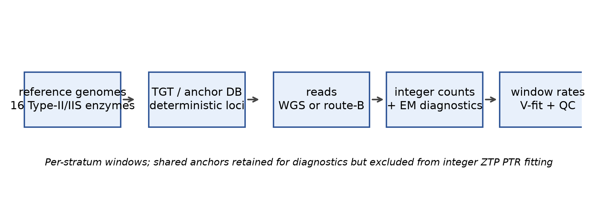
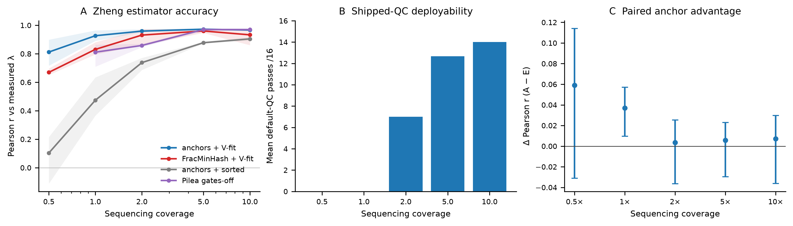
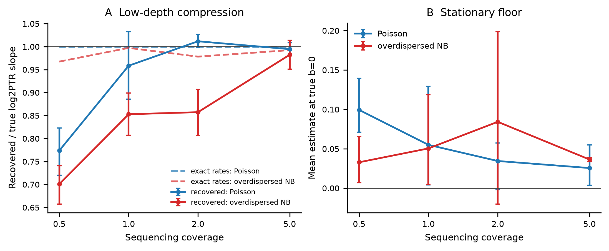
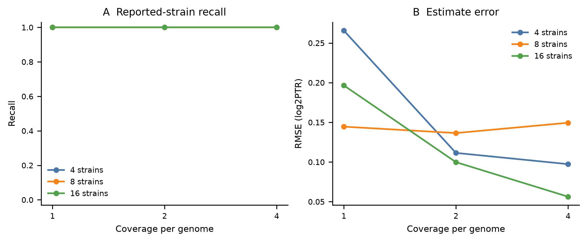
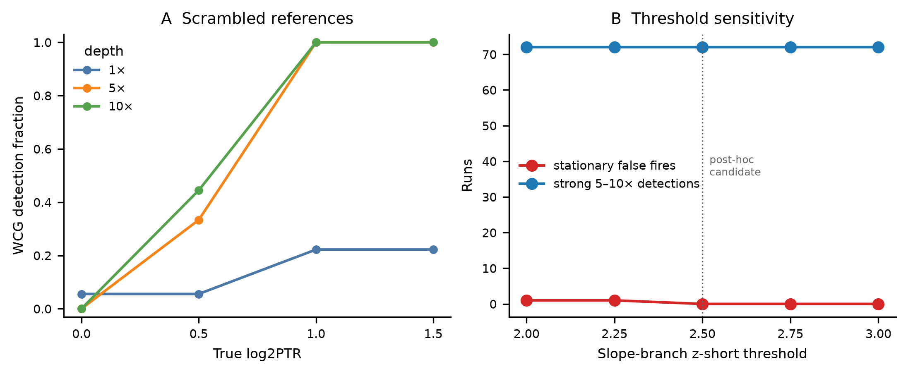
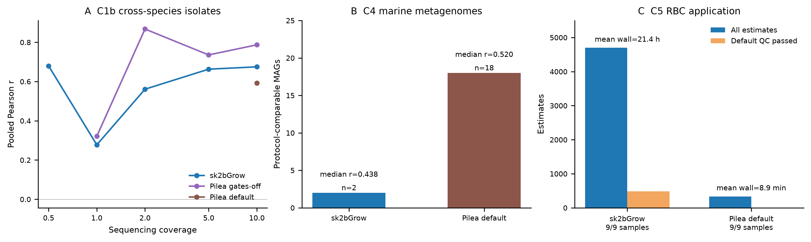

# Deterministic 2bRAD anchors enable coordinate-aware bacterial replication-rate estimation

## Abstract

Peak-to-trough ratios report bacterial replication from coverage along the
genome, but alignment-free sketches can discard genomic position and complicate
quality control. We present sk2bGrow, a deterministic 2bRAD/TGT-anchor pipeline
that indexes motif coordinates, estimates enzyme-stratified window rates, fits
origin-to-terminus gradients, and separates all-finite from quality-controlled
results. On the Zheng 2020 _Escherichia coli_ benchmark, anchors with
coordinate fitting reached mean Pearson r = 0.911 at 0.5× and r = 0.960 at 1×,
whereas sorted regression on the same anchors reached r = 0.130 and 0.571.
Shipped quality control nevertheless passed 0/16 media at both depths.
Cross-species isolates exposed an important boundary: pooled correlations
spanned 0.278–0.680 for sk2bGrow across 0.5–10×, while Pilea gates-off was
higher at 1–10×. In 20 marine metagenomes, sk2bGrow produced fewer
protocol-comparable MAGs than Pilea default (2/101 versus 18/101) and lower
median correlation (0.438 versus 0.520). Conversely, in nine rotating-biological-contactor
metagenomes, sk2bGrow recalled all 4,698 expected MAG-sample genome cells,
returned no suspicious confident absent-genome estimates, and passed QC for
484 estimates, but averaged 76,866 s per sample versus 536 s for Pilea default.
sk2bGrow therefore provides deterministic coordinate-aware signal and
application-scale recall, while current cross-species accuracy, real-community
coverage, QC and runtime set clear limits on deployability.

**Keywords:** bacterial growth rate; peak-to-trough ratio; replication rate;
2bRAD; metagenomics; sketching; benchmarking; microbiome

## Background

Bacterial growth rate affects infection dynamics, microbiome ecology and
experimental evolution. Marker-frequency methods estimate replication rate from
the coverage gradient between the replication origin and terminus. Tools such
as iRep, GRiD and CoPTR formalize this relationship for assembled genomes
[1–3]. Pilea introduced an alignment-free FracMinHash strategy that scales to
large read collections [4].

These advances expose three limitations. First, random sketches discard
position. Once a k-mer is sampled, the estimator no longer knows where it lies
on the genome, so trends must be recovered by sorting windows or ranks. This is
efficient, but the fitted range depends on extreme order statistics. Second,
arbitrary windows do not guarantee stable local information. A fixed number of
k-mers can be sparse in extreme GC regions, while a fixed genomic interval can
contain too few observations. Third, quality control is often aggregate. It is
difficult to ask whether enzyme-specific loci, sequence contexts and coordinate
regions support the same estimate.

Deterministic 2bRAD/TGT anchors provide a different design point. A restriction
motif defines a short tag at a genomic coordinate. The same reference produces
the same anchor set in every sample. Enzyme choice introduces sequence context,
and the anchor table can be audited before profiling [5]. The central question
is therefore whether retaining these coordinates and strata improves PTR
estimation and quality control.

We asked three questions. First, does coordinate-aware fitting recover
low-depth signal more reliably than sorted regression? Second, how much of the
observed difference is estimator signal rather than shipped-QC deployment?
Third, how do controlled advantages translate, or fail to translate, to real
isolates, marine communities and application-scale microbiomes?

We addressed these questions with sk2bGrow. The implementation digests
references into deterministic anchors, stores coordinates and enzyme strata,
counts reads against those loci, estimates window rates with zero-truncated
models, fits a signed origin-to-terminus gradient, fuses per-enzyme estimates,
and reports explicit all-finite and quality-controlled results.

Contributions:

1. A reproducible deterministic-anchor PTR benchmark with real isolates, real
   communities, simulated overdispersion, fragmented coordinates and
   mixed-strain tracks.
2. A coordinate-aware estimator that distinguishes all-finite signal from
   shipped default-QC deployment.
3. Diagnostics separating sorted-regression failure, window-rate compression
   and reference-coordinate destruction.
4. A provenance-controlled dataset, result archive, figure code and statistical
   supplement.

## Results

### Benchmark design

We used five arms so that sketch and estimator effects could be separated:

| arm | sketch | estimator |
|---|---|---|
| A | 16-enzyme anchors | adaptive windows + coordinate V-fit |
| E | FracMinHash | adaptive windows + coordinate V-fit |
| B | 16-enzyme anchors | 25 kb windows + sorted/RANSAC |
| C relaxed | FracMinHash | Pilea gates-off |
| C default | FracMinHash | Pilea shipped defaults |

The primary controlled real-data target was independently measured growth rate
lambda from Zheng 2020 [6]. RMSE against the paper's predicted log2 PTR is
reported as a
same-reads comparison, not independent absolute accuracy. Unless otherwise
stated, each medium-level estimate averages three sequencing-subsample seeds
before metrics are calculated. We report both all-finite estimates and
estimates passing shipped default QC.

**Figure 1.** sk2bGrow preserves deterministic anchor coordinates from
reference indexing through enzyme-stratified window fitting.

### Low-depth signal is present, but shipped QC does not certify it

Across 16 growing-media conditions, anchors + V-fit reached mean Pearson r =
0.911 at 0.5× and r = 0.960 at 1×. Under the same all-finite rule,
FracMinHash + V-fit reached r = 0.852 and 0.923. Coordinate-free sorted
regression on anchors reached r = 0.130 and 0.571. Pilea gates-off was
undefined at 0.5× because all 16 estimates collapsed to PTR = 1, and reached
r = 0.875 at 1×.

Shipped default QC passed 0/16 A-arm media at 0.5× and 1×, a mean of 7/16 at
2×, 12.7/16 at 5× and 14/16 at 10×. Counts varied across seeds: A-arm pass
counts were 8/8/5 at 2×, 14/11/13 at 5× and 14/15/13 at 10×. Thus
deterministic anchors retain low-depth signal, but current default QC does not
certify those estimates as deployable.

A 10,000-resample medium-level bootstrap gave A-arm Pearson intervals of
0.820–0.966 at 0.5× and 0.932–0.980 at 1×. The paired A-minus-E Pearson
advantage was 0.059 (-0.031 to 0.114) at 0.5× and 0.037 (0.010 to 0.057) at
1×. At 0.5×, the A-arm slope was lower than the E-arm slope. The supported
conclusion is therefore improved low-depth recall and rank recovery, not a
uniform significant accuracy win.

**Figure 2.** Zheng benchmark performance. **A**, all-finite correlations by
coverage and arm; shading shows seed range. **B**, mean shipped-QC passes for
the anchor + V-fit arm. **C**, paired A-minus-E Pearson bootstrap intervals.

The stationary RUN_OUT control supported this caution. A-arm log2 PTR values
across three seeds were 0.113/-0.015/0.083 at 0.5× and
0.033/-0.036/0.076 at 1×. Sorted regression falsely reported 2.12/2.26/1.99
and 1.94/1.93/1.94.

**Finding 1.** Deterministic coordinates preserve low-depth gradient signal,
but shipped QC does not yet certify that signal as deployable.

### Coordinate fitting, not anchor choice alone, explains the gain

At 1×, changing only the estimator changed the result. Anchors + V-fit reached
r = 0.960, whereas anchors + sorted regression reached r = 0.571. Changing the
sketch had a smaller effect under coordinate fitting: anchors reached r = 0.960
and FracMinHash reached r = 0.923.

**Finding 2.** Coordinate fitting, rather than deterministic motif choice
alone, explains most of the improvement over sorted regression.

### Overdispersed low-count windows, not Poisson truncation alone, cause residual compression

In simulations with known tent amplitudes, exact window rates passed through
the same windows, V-fit and fusion machinery recovered slopes close to one.
After signed fixed-origin fitting, recovered Poisson slopes were 0.774, 0.958,
1.012 and 0.995 at 0.5, 1, 2 and 5×. Overdispersed NB slopes were 0.701,
0.853, 0.857 and 0.982.

The stationary b=0 estimate was now small in all cells: 0.099/0.055/0.035/0.026
for Poisson and 0.033/0.050/0.084/0.036 for NB. Thus the earlier downhill-only
floor is no longer the dominant defect. Remaining NB compression at low depth
co-occurred with upward bias in low-rate windows.

**Figure 3.** Controlled A4 simulation. **A**, recovered and exact-rate slopes.
**B**, mean estimate at true log2 PTR = 0.

**Finding 3.** Signed fixed-origin fitting largely removes the stationary
floor; overdispersed low-count windows remain the main compression mechanism.

### Mixed-strain validation

We simulated communities from 16 bacterial references at 4, 8 or 16 strains,
1, 2 or 4× coverage per selected genome and two replicates. Strain-specific
true log2 PTR values were drawn from Uniform(0,2). Because several reference
assemblies contained multiple contigs or plasmid entries, we used explicit
coordinate fitting rather than the conservative fragmented-auto refusal.

The current run completed all 18 cells. Recall was 1.00 in every strain-count
and coverage cell, with no spurious genomes. Aggregate RMSE was 0.140 and mean
signed bias was 0.015 log2 units. RMSE decreased with coverage for 16 strains
from 0.197 at 1× to 0.100 at 2× and 0.056 at 4×. At 4 strains it fell from
0.266 at 1× to 0.111 at 2× and 0.097 at 4×. This result shows that the
production stack can retain and estimate all simulated strains in the tested
range, but it does not measure competitive performance against absent external
tools.

**Figure 4.** Mixed-strain simulation recall and RMSE by strain number and
coverage.

This controlled test measures attribution in a known community. It does not
replace real metagenomic validation.

### Fragmented-coordinate QC is promising but not production-ready

A two-branch within-contig gradient statistic was evaluated on 324 scrambled,
ordered and complete reference profiles. Complete and ordered controls were
quiet: 0/36 complete and 0/72 ordered. Scrambled references fired in 15/54
cells at true log2 PTR = 0.5 and 40/54 at each of log2 PTR = 1 and 1.5.
Detection was complete for scrambled log2 PTR >= 1 at 5–10× (72/72).

One scrambled stationary control fired at 1×. A post-hoc sensitivity check
found that raising the slope-branch z-short cut from 2.0 to 2.5 removed that
false fire while retaining all strong 5–10× detections. Because this threshold
was selected after seeing the grid, WCG remains prototype evidence.

**Figure 5.** Fragmented-coordinate QC. **A**, scrambled-reference detection
by true PTR and depth. **B**, sensitivity of stationary false fires and strong
detections to the slope-branch threshold.

**Finding 4.** Within-contig gradients can identify destroyed coordinates in
the strong 5–10× regime, but independent validation is required before
production use.

### Real isolates, marine communities and RBC application define deployment boundaries

Three real-data tracks tested whether the controlled results generalize. In
C1b, four _Bacillus subtilis_, _Klebsiella pneumoniae_, _Morganella morganii_
and _Pseudomonas putida_ wastewater isolate species were profiled across
0.5–10×. All 18 evaluable cells returned sk2bGrow estimates at every depth.
Pooled correlations against digitized measured growth rates were 0.680, 0.278,
0.561, 0.663 and 0.675 at 0.5, 1, 2, 5 and 10×, respectively. Pilea gates-off
was undefined at 0.5× but slightly exceeded sk2bGrow at 1× (0.321) and was
clearly higher at 2–10× (0.868, 0.736 and 0.787). C1b therefore fails to
support a cross-species accuracy-superiority claim.

The C4 marine benchmark used 20 real surface-water metagenomes and 101 marine
MAGs. sk2bGrow completed all samples and produced an estimate for 51 MAGs,
compared with 64 for Pilea default. Only two MAGs were represented in both
protocols sufficiently for a matched comparison, versus 18 for Pilea default;
the corresponding median protocol correlations were 0.438 and 0.520. Because
the published growth-rate truth was inferred from the same sequencing reads,
C4 measures agreement under a noisy external protocol rather than absolute
PTR accuracy.

C5 tested application scale in nine rotating biological contactor (RBC)
metagenomes against 522 bacterial MAGs. sk2bGrow returned estimates for all
4,698 expected MAG-sample cells (recall = 1.00); 484 estimates passed default
QC and no confident estimate mapped to an absent genome. Pilea default
returned 333 total estimates with mean recall 0.071, whereas Pilea gates-off
returned 1,432 estimates with mean recall 0.914 but represented only three of
nine samples.
The main deployment limitation was cost: mean wall time was 76,866 s for
sk2bGrow, 536 s for Pilea default and 2,379 s for the three represented Pilea
gates-off samples. C5 thus demonstrates recall and workflow coverage, not
independent community growth-rate accuracy.

**Figure 6.** Real-isolate, marine-community and RBC application results.
**A**, pooled Pearson correlations in C1b by depth and protocol; missing points
indicate an undefined metric. **B**, C4 protocol-comparable MAG counts (bars)
and median correlations (points). **C**, C5 total and QC-passed estimates;
mean wall time is shown above each bar. Pilea gates-off is omitted from the
C5 bar comparison because only 3/9 samples completed.

**Finding 5.** Real data narrow the method's claim: sk2bGrow preserves
application-scale recall in RBC communities, but Pilea gates-off or default
currently provides stronger cross-species isolate accuracy and greater
real-marine protocol coverage.

## Discussion

sk2bGrow shows that deterministic restriction anchors are useful for more than
taxonomic marking. When their coordinates are retained, they support direct
origin-to-terminus fitting, enzyme-stratified QC and reproducible low-depth
evaluation. The central practical distinction is between estimator signal and
deployable output. sk2bGrow can produce informative low-depth estimates, but
current default QC rejects many of them. This conservative behavior is
preferable to reporting every fit, but low-depth deployment requires further QC
development.

The controlled comparison also avoids attributing all gains to anchor choice.
Under coordinate fitting, FracMinHash remained competitive. The large low-depth
failure occurred with sorted regression on anchors. Coordinate preservation in
the estimator, rather than motif choice alone, drives the main improvement.

The A4 result clarifies mechanism. Zero-truncated window modelling was not the
sole source of low-depth compression. Signed fixed-origin fitting made the
stationary floor small and brought Poisson slopes close to unity by 1×.
Remaining NB compression at low depth is consistent with overdispersion and
upward bias in weakly observed windows. Future work should model per-anchor
efficiency jointly rather than correcting windows after truncation.

Mixed-strain simulation addresses attribution, but not full community
deployment. The real-data tracks narrow the claim in three ways. First,
divergent cross-species references reduce isolate accuracy relative to Pilea
gates-off. Second, sparse marine MAG coverage limits the number of matched
comparisons and indicates that anchor coverage and QC behavior, not only the
coordinate-aware estimator, control real-community utility. Third, RBC data
show that complete reporting is possible at application scale but can be
orders of magnitude slower. These results do not support a blanket claim that
sk2bGrow outperforms existing tools; they support a coordinate-aware benchmark
design that separates signal, deployment readiness and application coverage.

## Conclusions

Deterministic 2bRAD/TGT anchors make genomic position, enzyme context and
coordinate integrity explicit in PTR estimation. The controlled results show
strong low-depth estimator signal and complete attribution in a 16-genome
mixed-strain grid, while QC correctly prevents those values from being treated
as certified deployments. Real isolates, marine metagenomes and RBC communities
further show that current cross-species accuracy, marine protocol coverage and
runtime remain material barriers. sk2bGrow is therefore best viewed as a
reproducible boundary-aware benchmarking and application framework, with
cross-species calibration, faster counting and independently validated
community accuracy as priorities before broad production use.

## Limitations

1. The real-data target was one _E. coli_ K-12 MG1655 isolate. The three
   sequencing subsamples are technical read-sampling replicates, not biological
   replicates.
2. All-finite and default-QC results answer different questions. Low-depth
   all-finite performance cannot be quoted as deployable performance.
3. Pilea gates-off was competitive under matched coordinate fitting. The study
   does not support a uniform accuracy-superiority claim.
4. The current ZTP PTR model does not use EM fractional weights. Shared
   anchors are retained as diagnostics and conservatively excluded from PTR.
5. WCG is a prototype coordinate-QC statistic and has not been independently
   validated as a production gate.
6. The current comparison focused on Pilea. Broader comparison with iRep, GRiD,
   CoPTR and DEMIC is required for a general PTR-tool benchmark.
7. The mixed-strain evaluation is simulated. Strain abundance, sequence
   divergence and real metagenomic background are simplified.
8. C1b and C4 use externally derived, sometimes noisy growth-rate targets; C5
   has no independent growth-rate truth. Real-community results therefore
   cannot be interpreted as absolute PTR accuracy.
9. The C1b, C4 and C5 runs used an earlier sk2bGrow commit plus working-tree
   fixes, whereas Zheng, A4, R3 and mixed-strain used the current implementation
   state. This version heterogeneity is explicitly reported in Methods.

## Methods

### Anchor database

References were converted to uppercase ACGT sequences and digested with 16
2bRAD-associated enzyme definitions. A tag was accepted only when its entire
window matched one enzyme pattern, contained no ambiguous bases and lay wholly
inside the contig. Tags were stored as forward-strand windows, and canonical
hashing allowed reads from either sequencing strand. The database retained
genome, contig, coordinate, enzyme, pattern, local GC and flag fields.

Anchors were considered unique within a genome by distinct genomic locus rather
than anchor row. Thus two enzymes at one locus were not mistaken for a repeat.
Anchors shared across genomes were retained for counting and EM diagnostics but
flagged and excluded from conservative PTR fitting.

### Read counting

Reads were scanned for complete enzyme tag windows. Candidate tags were matched
by canonical hash and verified against stored bases. Hamming mismatch tolerance
was two by default. The best distance was retained; multimapping observations
were kept for diagnostics. Real 2bRAD mode stopped after the first confirmed
tag per read. Shotgun mode counted every complete tag window wholly contained
in a read.

The count table contains raw integer observations. The EM sidecar contains
fractional assignments for shared anchors, but the current ZTP PTR layer does
not consume fractional weights. Database-shared anchors are excluded from
conservative PTR fitting.

### Window rates

Counts were windowed separately for each enzyme. Auto windowing targeted 25
windows per enzyme, used at least 25 anchors per window and capped windows at
100 anchors. Each window was fitted with zero-truncated Poisson or
zero-truncated negative-binomial models selected by BIC. A negative-binomial
fit was rejected when its implied detection probability contradicted the
observed detected fraction. Window rates were converted to log2 rates with
delta-method standard errors.

Per-enzyme GC curves were fitted by lowess on raw anchor counts and shrunk by
explained variance. Window rates were corrected by subtracting the mean
anchor-level GC offset.

### Coordinate fitting

For a candidate origin, circular distance d was used in

    log2 mu(x) = a - b1 min(d,k) - b2 max(d-k,0).

With one slope this is the ordinary origin-to-terminus V. With two slopes it
represents multi-fork replication. Model selection used BIC, and segmentation
was considered only with at least 30 windows and a plain fit suggesting log2
PTR >= 1.

When the origin was supplied or fixed, slope signs were allowed so stationary
or near-stationary samples could produce small negative gradients. When the
origin was searched, uphill solutions were rejected to prevent the terminus
from masquerading as the origin. Weighted least squares used inverse-variance
window weights. A second pass re-expressed standard errors as a smooth function
of fitted values to reduce self-weighting.

### Enzyme fusion and quality control

Per-enzyme fits were fused by inverse-variance weighting. Cochran's Q tested
between-enzyme heterogeneity. When Q rejected homogeneity,
DerSimonian-Laird random-effects weights widened the interval. Output retained
estimates even when QC failed and reported the reason.

Default QC required coverage >= 1, detected fraction >= 0.75, dispersion <= 5,
containment >= 0.5, enzyme consistency p >= 0.05, enzyme fit rate >= 0.8 and a
finite estimate.

### Zheng benchmark

We used 16 growing-media conditions and one stationary RUN_OUT condition from
Zheng 2020 BioProject PRJNA615952. Three sequencing subsample seeds were used.
Seed s0 was the archived C1 paired subsample; s1 and s2 were deterministic
paired resamples of the C1 20x pool. They quantify technical read-sampling
variability and are not biological replicates.

Metrics averaged the three seed estimates within each medium and compared
across 16 growing media. The stationary control was excluded from correlation
metrics. Uncertainty used a 10,000-resample medium-level bootstrap. For each
resampled medium, the three seed estimates were averaged before calculating
the metric. Paired A-minus-E deltas used the same resampled media.

### A4 low-depth simulation

Reads were simulated from real E. coli K-12 coordinates with a tent-shaped
coverage gradient whose amplitude was the true log2 PTR. Depth was
0.5/1/2/5×, true log2 PTR was 0/0.5/1/1.5/2 and there were three seeds. Two
arms were used: Poisson counts and per-kilobase lognormal efficiency followed
by NB-like overdispersion. Exact expected anchor counts were calculated from
the same simulator weights and joined to production windows.

### Mixed-strain simulation

A 16-genome reference panel was digested and indexed. Communities contained 4,
8 or 16 strains at 1, 2 or 4× coverage per selected genome, with two
replicates. Strain-specific log2 PTR values were drawn from Uniform(0,2), and
reads followed a V-shaped gradient from each strain origin. Because several
reference assemblies included multiple contigs or plasmid entries, explicit
coordinate fitting was used instead of fragmented-auto refusal. Output
estimates were matched to known selected genomes. Recall was the fraction of
true strains reported; RMSE used matched strains.

### R3 coordinate-QC statistic

The within-contig gradient statistic used two branches. The slope branch
estimated per-contig slopes, corrected their variance by residual chi-square
and compared local amplitude with the global fitted amplitude. The jump branch
compared boundary-crossing rate steps with within-contig steps after
subtracting the sampling-noise floor. A flag required either branch to exceed
its threshold. The current refresh evaluated 27 references across three
origin-layout families, 12 read cells and 324 profiles.

Threshold sensitivity varied the slope-branch z-short cut from 2.0 to 3.0. The
original cut produced one stationary false fire; a post-hoc cut of 2.5 removed
that fire without losing strong 5–10× detections. Independent validation is
required before production use.

### Real-community benchmarks

C1b used PRJNA1280254, the isolate dataset from the Pilea study. Twenty runs
represented four wastewater isolate species across five nutrient
concentrations and were subsampled to 0.5, 1, 2, 5 and 10× coverage of each
species assembly. sk2bGrow used the full 16-enzyme panel and its fixed
coordinate estimator; Pilea v1.3.8 was run with shipped defaults and with
gates off (`-x 0 -z 0 -c 0`). Per-run measured growth rates were digitized
from the source figure and validated by reproducing the printed panel-level
correlations to within 2 × 10^-4^; RMSE against the paper's predicted log2 PTR
was treated as a same-reads comparison rather than independent accuracy.

C4 used PRJNA551656 with 20 marine surface-water metagenomes and 101 marine
MAGs. We compared sk2bGrow with Pilea default and recorded both estimates and
QC outcomes. A MAG was counted for protocol correlation only when the two
protocols had comparable samples and finite estimates; this criterion explains
why the matched set (2/101) is smaller than the set of any sk2bGrow estimate
(51/101). Growth-rate truth from Long et al. was derived from the same reads
and was treated as a noisy external reference [7].

C5 used PRJNA974210: nine RBC metagenomes profiled against 522 bacterial MAGs,
giving 4,698 expected MAG-sample cells. Outcomes were total estimates, default
QC passes, recall over expected cells, suspicious confident estimates for
absent genomes and measured wall time. Pilea gates-off was summarized but not
compared as a balanced application arm because only three of nine samples were
represented.

These real-community runs were completed before the current implementation
refresh using sk2bGrow commit `275778f350b87e10c6366bf90884d965fbab45a6` plus
working-tree fixes to `python/sk2bgrow/fit.py` and `python/sk2bgrow/ztp.py`.
They were not rerun at the current commit. This provenance limitation is
retained because the results are informative but not a current-code benchmark.

### Statistical reporting

Media bootstrap intervals used 10,000 resamples. Seed estimates were averaged
within a resampled medium so that three technical seeds were not treated as
independent media. A4 intervals resampled replicates within each true
amplitude. R3 detection intervals used Wilson scores. Exploratory bootstrap p
values were not corrected for multiplicity and were not treated as
confirmatory.

## Availability of data and materials

The implementation, benchmark scripts, result archives and figure code are in
the sk2bGrow repository. The 2026-09-30 refresh and 2026-10-01 review
diagnostics are stored under `benches/refresh_20260930/`. The current
mixed-strain validation is stored under `benches/mixedstrain_20261001/`.
Real-community summaries are stored under
`benches/realcommunity_20261001/remote_summaries/`. Zheng data are available
from BioProject PRJNA615952; C1b from PRJNA1280254; C4 from PRJNA551656; and
C5 from PRJNA974210. Source and result archive
hashes are recorded in `docs/PAPER_RESULTS.md`,
`benches/refresh_20260930/README.md` and the statistical supplement.

## Abbreviations

2bRAD: two-base encoded RAD; C1b: cross-species isolate benchmark; C4: marine
real-community benchmark; C5: rotating-biological-contactor application;
EM: expectation-maximization; MAG: metagenome-assembled genome;
NB: negative binomial; PTR: peak-to-trough ratio; QC: quality control;
RBC: rotating biological contactor; RMSE: root mean squared error;
WCG: within-contig gradient; ZTP: zero-truncated Poisson

## Declarations

### Ethics approval and consent to participate

Not applicable. This study used only publicly available sequencing data and
simulated reads.

### Consent for publication

Not applicable.

### Competing interests

The authors declare no competing interests.

### Funding

To be completed from the award information used to support this project.

### Authors' contributions

To be completed in accordance with CRediT after author-list confirmation.

### Acknowledgements

To be completed at submission.

## References

1. Brown CT, Olm MR, Thomas BC, Banfield JF. Measurement of bacterial
   replication rates in microbial communities. _Nat Biotechnol_.
   2016;34:1256–63. doi:10.1038/nbt.3704
2. Emiola A, Oh J. High throughput in situ metagenomic measurement of bacterial
   replication at ultra-low sequencing coverage. _Nat Commun_. 2018;9:4956.
   doi:10.1038/s41467-018-07240-8
3. Joseph TA, Chlenski P, Litman A, Korem T, Pe'er I. Accurate and robust
   inference of microbial growth dynamics from metagenomic sequencing reveals
   personalized growth rates. _Genome Res_. 2022;32:558–68.
   doi:10.1101/gr.275533.121
4. Chen X, Xu X, Lin Y, Shi X, Wang D, Zhang T. Pilea: profiling bacterial
   growth dynamics from metagenomes with sketching. _Microbiome_.
   2026;14:128. doi:10.1186/s40168-026-02374-0
5. Sun Z, Huang S, Zhu P, et al. Species-resolved sequencing of low-biomass or
   degraded microbiomes using 2bRAD-M. _Genome Biol_. 2022;23:36.
   doi:10.1186/s13059-021-02576-9
6. Zheng H, Bai Y, Jiang M, et al. General quantitative relations linking cell
   growth and the cell cycle in _Escherichia coli_. _Nat Microbiol_.
   2020;5:995–1001. doi:10.1038/s41564-020-0717-x
7. Long AM, Hou S, Ignacio-Espinoza JC, Fuhrman JA. Benchmarking microbial
   growth rate predictions from metagenomes. _ISME J_. 2021;15:183–95.
   doi:10.1038/s41396-020-00773-1
