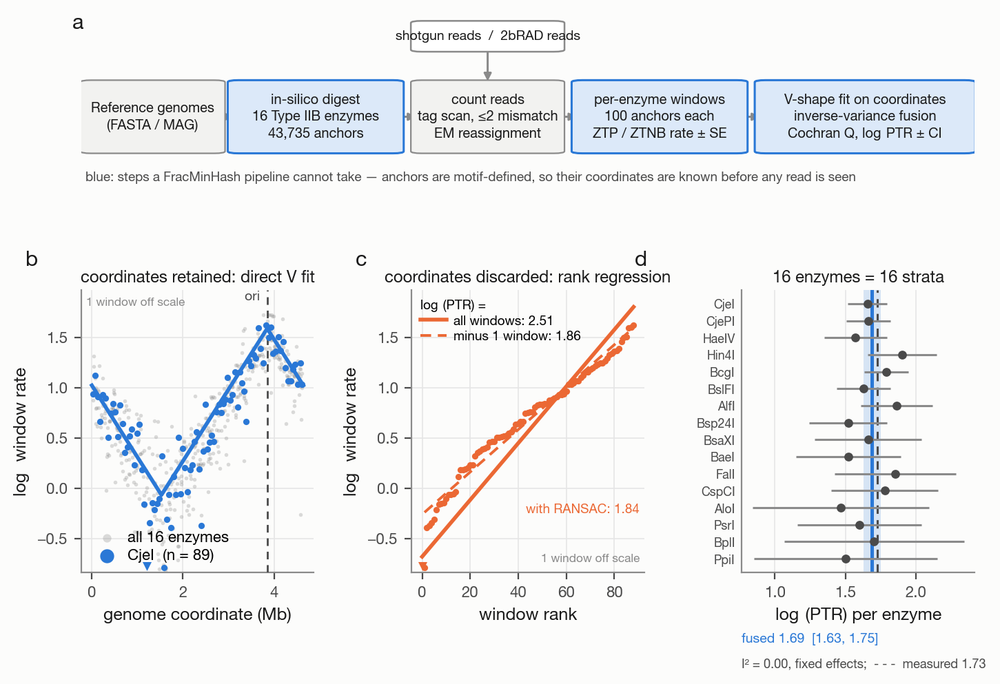
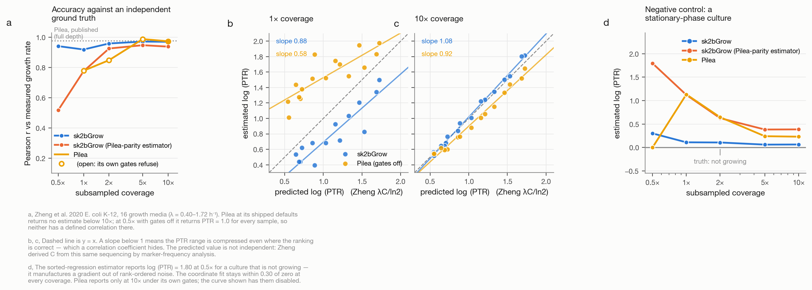
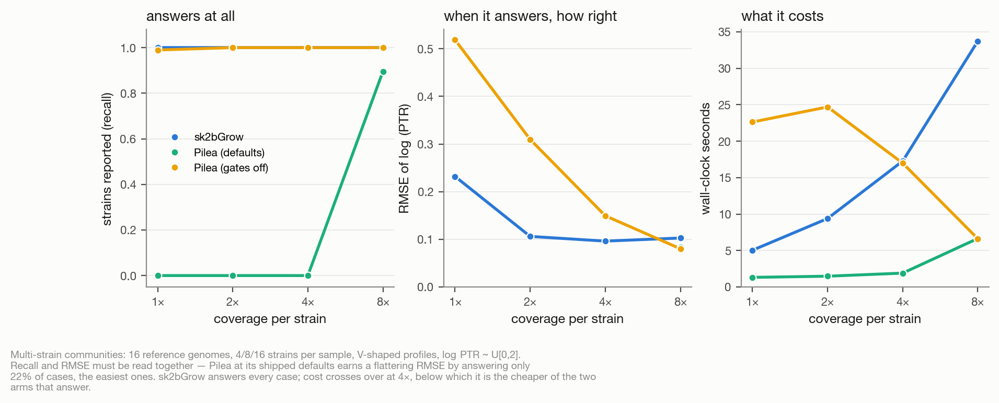
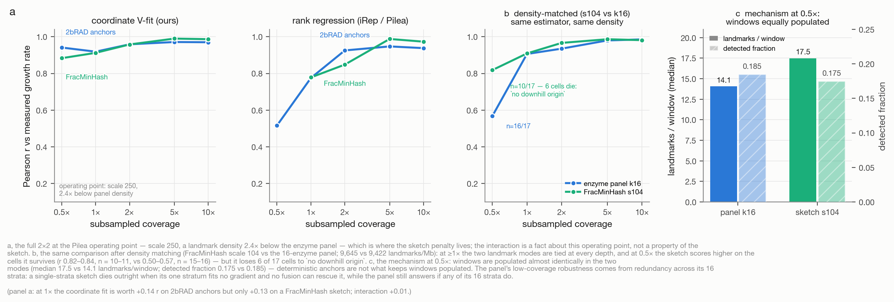
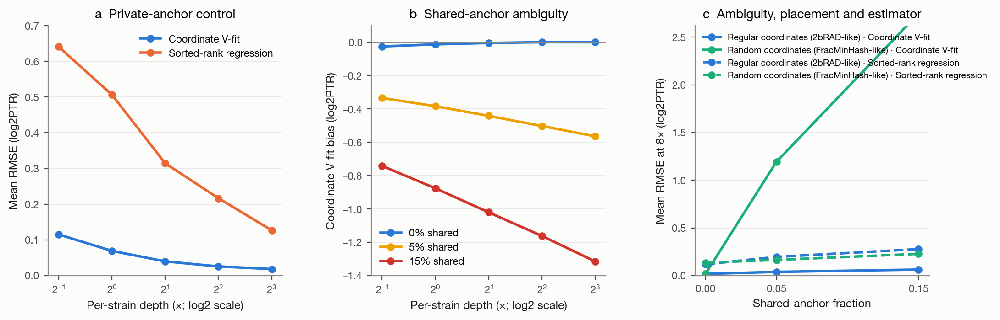
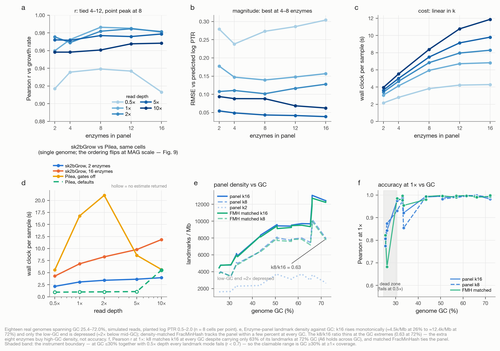
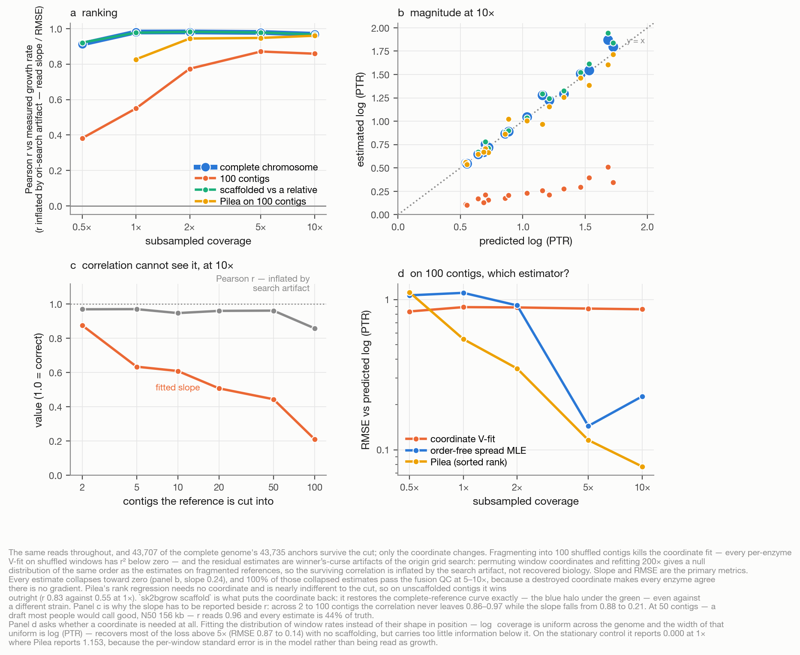
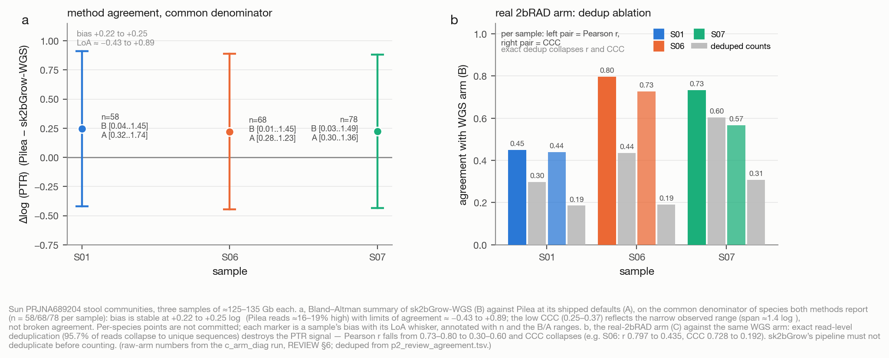
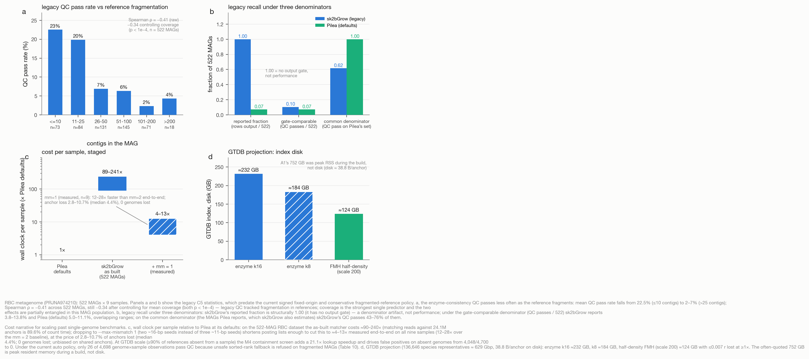

# Coordinate-aware V-fitting enables shallow-depth PTR estimation from 2bRAD anchor panels

## Title page

**Authors:** [Complete author list before submission]

**Affiliations:** [Complete institutional affiliations before submission]

**Corresponding author:** [Name], [institutional address], [email], [ORCID]

**Article type:** Research article

**Target journal:** *Microbiome*

**Revision provenance:** Internal review revision 2026-09-22. The primary Zheng grid uses signed fixed-origin fitting and single-pass GC correction; residual two-pass GC correction remains diagnostic only. This revision adds the count-level factorial analysis (F6) and the post-hoc C5 k8/mismatch-1 deployment benchmark.


## Abstract

Peak-to-trough ratio (PTR) inference from metagenomes is a culture-independent proxy for bacterial growth rates, but the current sketch-based estimator requires a depth that metagenomic per-strain coverage rarely reaches, and its shipped coverage gates return no estimate at all below ~10×. We present sk2bGrow, which counts Type IIB restriction-enzyme (2bRAD) anchors — motif-defined loci whose genome coordinates are known a priori and identical across samples — and fits the replication gradient with a coordinate-aware windowed V-fit. On the Zheng *E. coli* growth-rate panel, sk2bGrow returned usable PTR estimates at 1–2× sequencing depth, where Pilea's shipped defaults return nothing, with r = 0.92 at 1× and 0.96 at 2× against measured growth rates (n = 16). The accuracy comes from the coordinate-aware estimator, not the landmark source — at matched density, the two landmark sources were not significantly different in the paired bootstrap at any depth — while the multi-enzyme panel contributes what a hash sketch cannot: a wet-lab-realizable landmark set and consistency strata whose heterogeneous biases exposed our own counting defect. A post-hoc count-level factorial further separates shallow-depth extraction from multi-reference assignment: coordinate fitting was accurate for private anchors, whereas shared-anchor ambiguity introduced a depth-amplified negative bias. The estimates are not unbiased — the fitted slope compresses the dynamic range at low coverage, and the compression mechanism remains unresolved. On three fecal metagenomes, sk2bGrow and Pilea agreed (bias +0.22–+0.25 log2; n = 58–78 species×sample pairs per sample). As a process-level finding, exact deduplication of 2bRAD libraries before counting destroys the PTR signal — a PCR copy-number artefact we localize per anchor. sk2bGrow is 89.5–240.8× slower than Pilea at MAG-panel scale; mismatch-1 counting narrows the gap to roughly one order of magnitude (measured end-to-end on all nine samples: 20.5–38.8× faster counting than the mismatch-2 baseline, no genome lost), and a containment pre-screen — measured to clear the absent-reference false-positive floor, and required at database scale where an unrestricted index would emit estimates for absent references — completes the fix.

## Keywords

peak-to-trough ratio; microbial growth dynamics; 2bRAD; FracMinHash; metagenomics; shallow sequencing

## Background

The peak-to-trough ratio (PTR) of a replicating bacterial chromosome — the coverage ratio between the replication origin and the terminus — is a culture-independent proxy for growth rate: in an exponentially growing population, log₂PTR equals the ratio of the replication period to the doubling time, and is therefore proportional to the growth rate at a fixed replication period [1]. Because the signal lives in the shotgun sequencing data itself, PTR inference has been applied to growth estimation directly from metagenomes [1–4], removing the need to culture the organisms of interest.

A recent alignment-free turn made such profiling tractable at the scale of thousands of reference genomes: instead of aligning reads, methods count k-mers surviving a random subsample of the k-mer universe, such as a FracMinHash sketch [4,8]. That convenience has a cost the PTR problem is unusually sensitive to. A random sketch discards **position**: the genome coordinates of the surviving k-mers are arbitrary, and no two references share them in any usable way. A sketch-based PTR estimator must therefore regress coverage on *sorted rank* rather than on genome position. Sorted-rank regression rides on extreme order statistics — its estimate is set by the largest and smallest surviving windows — and is fragile exactly where metagenomic data live: one dropout window can move the estimate from 1.86 to 2.51 (Fig. 1c). The shipped tools also protect the estimator with coverage gates that return no estimate at all below roughly 10× depth.

Type IIB restriction-enzyme anchors, the markers of the 2bRAD family of reduced-representation protocols [5–7], are a sketch with a different geometry. Each enzyme recognises a short degenerate motif and excises a fixed-length tag, so the landmark loci are motif-defined, enumerable per reference, and — the property this paper exploits — their coordinates are known before any read is seen and are identical in every sample. That makes coordinates usable: coverage can be regressed directly on position along the chromosome, in fixed-anchor windows, with a windowed V-fit and inverse-variance fusion across enzymes. A panel of enzymes additionally provides internal-consistency strata (here, sixteen) that a single hash-prefix sketch does not. And because the same loci are physically produced by the 2bRAD protocol, the landmark set is wet-lab realizable as well as computational.

We present sk2bGrow, built on this observation. We state the claim honestly up front, because our own attribution data constrain it: the accuracy at low depth comes from **fitting on coordinates**, not from which landmarks are counted — the coordinate-aware estimator beats sorted-rank regression by wide margins at 0.5–1× on *both* enzyme anchors and a density-matched FracMinHash sketch, and the two landmark sources were not significantly different at any depth once density was matched (paired bootstrap over 48 media × subsampling-instance units; Results §4). What the motif-defined **panel** contributes is not accuracy but things a hash sketch cannot provide: a landmark set the 2bRAD protocol physically produces; enzyme strata whose heterogeneous biases make cross-stratum consistency a test of systematic error — Cochran's Q caught this project's own double-counting defect; and fusion redundancy at very low input (F1 harness). The results below report slope and RMSE beside correlation throughout, include a negative control the incumbent excluded, and carry the bias caveats the data impose.

In short, this paper contributes (i) usable PTR estimates at 1–2× sequencing depth, with the low-coverage bias stated rather than hidden; (ii) a controlled 2 × 2 attribution localising the gain in the coordinate-aware estimator rather than in which landmarks are counted — the two landmark sources showed no significant paired-bootstrap difference once density was matched; and (iii) real-metagenome concordance with the incumbent and process-level findings — a deduplication recommendation and a per-anchor capture-efficiency measurement — that others can cite.

## Methods

Section order follows Pilea (Microbiome 2026) so the two papers can be read
side by side. Every number quoted here is reproduced by the scripts in
[sk2bGrow/benches](https://github.com/HuangShiLab/sk2bGrow) from the tables in
`data/`. Sections 3.5–3.6 and 6 report experiments that have no Pilea
counterpart — the landmark-source, robustness and HPC-scale questions are new
with this paper.

---

### 1. The sk2bGrow algorithm

sk2bGrow estimates the peak-to-trough ratio (PTR) of a genome from the
replication gradient in read coverage. For an exponentially growing population
with replication period *C* and doubling time τ,

$$\log_2 \mathrm{PTR} \;=\; C/\tau \;=\; \lambda C/\ln 2 ,$$

so log₂PTR is proportional to growth rate λ at fixed *C*. The pipeline
(**Fig. 1a**) has six stages.

#### 1.1 Anchor database construction (offline, once)

Reference genomes are digested *in silico* with a panel of 16 Type IIB
restriction enzymes (§2). Each enzyme recognises a short degenerate motif and
cleaves on **both** sides of it, excising a fixed-length tag of 25–33 bp. A
**anchor** is one such tag together with its genomic coordinate.

The digest slides a window of the enzyme's tag length along both strands and
tests it against that enzyme's IUPAC pattern set. Pattern sets are
reverse-complement closed by construction (enforced by a unit test), so a locus
is found from either strand and is reported once. Windows containing a non-ACGT
base are rejected rather than resolved; soft-masked (lowercase) reference
regions are **kept**, which is a deliberate divergence from Fast2bRAD-M, whose
exact-byte matcher silently skips them.

Each anchor carries:

* its genome, contig and coordinate;
* the local GC fraction over ±250 bp, quantised to 0.5 % steps;
* uniqueness flags — unique within its genome, unique across the database,
  multi-copy, shared, non-chromosomal.

Multi-copy and shared anchors are flagged, not deleted; the flags are what the
EM step (§1.2) and the QC layer act on. For *E. coli* K-12 MG1655
(GCF_000005845.2) the 16-enzyme panel yields **43,735 anchors**, of which
**42,234 are usable** after masking: mean spacing 110 bp, median 59 bp, 99th
percentile 647 bp, largest gap 6,007 bp (3 gaps > 5 kb). That is **227 usable
anchors per 25 kb** against **98 k-mers per 25 kb** in a Pilea FracMinHash
sketch of the same genome (18,261 k-mers; k = 31, s = 250) — 2.3× the density,
before any difference in estimator.

The essential property is that anchor coordinates are **motif-defined and
therefore known before any read is seen**, and are identical in every sample.
A FracMinHash sketch is a random subset of k-mers whose positions carry no
usable structure, which is why sketch-based PTR estimators regress on window
*rank* rather than window *position*.

#### 1.2 Read counting and anchor attribution

Reads are scanned exactly as reference genomes are: slide a window of each
enzyme's tag length and test the enzyme's patterns. A 2bRAD tag is not an
arbitrary k-mer but a fixed-length window under a motif constraint, so this is
both the correct model and cheaper than hashing every k-mer. It also makes
shotgun metagenome reads (route A) and bench-generated 2bRAD reads (route B) one
code path — in route B the read *is* the tag.

Matching is strand-canonical and tolerates up to **2 mismatches**. With a budget
of *m* mismatches a tag is split into *m*+1 contiguous seeds; by the pigeonhole
principle at least one seed survives intact, so probing all *m*+1 seed slots
cannot miss a true match. Candidates are verified by full Hamming distance
against the stored tag.

A tag is counted only when it lies **wholly inside** the read. For 150 bp reads
and a 32 bp tag this retains (150 − 32 + 1)/150 ≈ 0.79 of the local depth — the
same factor that applies to a k = 31 sketch, so the two methods are compared at
matched *effective* depth rather than matched nominal coverage.

A single physical read window can satisfy **two enzymes'** patterns, because the
panel is not disjoint: every Bsp24I site is also a CjePI site (§2). Such a window
is one observation and is credited **once to each stratum it belongs to**. The
read is therefore scanned once per distinct tag length, not once per enzyme —
scanning per enzyme visits the shared window twice and counts the locus twice for
both enzymes. That is not hypothetical: it was a defect in this implementation,
and it inflated CjePI's total count on *E. coli* K-12 by 21.5 %, concentrated at
1,352 loci hit exactly 2.00× of which 94.7 % were Bsp24I sites. Because the
inflation is *local* rather than uniform it distorts the coverage profile instead
of cancelling in the fit's intercept.

Anchors shared between reference genomes are split by expectation-maximisation,
following the shared-k-mer reassignment Pilea borrows from sylph. Each shared
count is apportioned in proportion to current genome abundances; abundances are
re-estimated from **unique anchors only** on every iteration, which keeps the
fixed point identifiable (a genome with no unique anchors cannot inflate itself
without bound). Convergence is a relative abundance change below 10⁻⁶ or 100
iterations.

#### 1.3 Windows and window rates

Windows are cut **inside each (genome, enzyme) series**, in coordinate order,
holding a fixed *number of anchors* rather than a fixed number of base pairs.
Equal-anchor windows equalise statistical power along the genome; equal-bp
windows do not, because anchor density varies. Windows never straddle a contig
boundary — two anchors on different contigs have no defined genomic distance.

Anchor density varies ~20-fold across the panel (CjeI 1,962/Mb, PpiI 74/Mb on
*E. coli*), so a single window size cannot serve all sixteen enzymes: at a flat
100 anchors/window the three sparsest enzymes would get 3–4 windows each and
drop out. The size is therefore chosen per enzyme as

```
anchors_per_window = clamp(n_anchors / 25, 25, 100)
```

targeting ≈25 windows per enzyme. Sparse enzymes get smaller, noisier windows
and consequently *earn less weight* in the fusion (§1.6), which is the correct
way for them to count less.

Within a window, counts are modelled as a **zero-truncated Poisson (ZTP)
mixture** — parameters by EM, component count by BIC — and the highest-weight
component's rate is the window's expected coverage. Truncation matters because
systematic sequence divergence makes some reference anchors genuinely absent
from a sample; counting those as true zeros drags an untruncated fit downward.
A **zero-truncated negative binomial (ZTNB)** branch is available for residual
overdispersion and is selected by BIC rather than by a coverage threshold; at
low coverage NB is unidentifiable and BIC falls back to ZTP automatically.

Every window rate is returned with a standard error. That is what makes the
inverse-variance fusion of §1.6 possible and is the piece a bootstrap has to
approximate.

*Numerical note.* The NB log-likelihood needs the rising factorial
lgamma(k+r) − lgamma(r) with r = 1/α. As α → 0 both terms diverge and their
difference loses all precision in double arithmetic; the implementation instead
accumulates Σᵢ log(r+i) directly. Without this, a degenerate α ≈ 0 fit gains
~12 spurious log-likelihood units and BIC selects NB everywhere.

#### 1.4 GC bias correction

Every Type IIB recognition site has its own base composition, so the 16 enzymes
sample sixteen different, individually narrow GC neighbourhoods. A single global
correction curve averages them into a shape that fits none of them. sk2bGrow
therefore fits a loess curve of log₂ efficiency against GC **within each
enzyme**, and applies it **at anchor resolution** (each anchor's own ±250 bp GC),
averaging into the window only afterwards — correcting on a window's mean GC
would discard exactly the within-window variation the correction exists to
remove.

The correction is an **offset in log₂ space**, never a rescaling of counts: the
window models need integer counts, and a multiplicative fudge would silently
break the zero-truncation.

A constant per-enzyme efficiency factor cannot bias PTR, because each enzyme is
fitted separately and a constant offset is absorbed by that fit's intercept.
Only GC *slope within an enzyme* matters. Per-enzyme efficiency factors are
still reported, for QC.

We use this historical single-pass correction as the primary default. A residual
second pass was tested as a diagnostic but not adopted. Holding reads and
estimator fixed, it changed 0.5×/1× anchor-panel accuracy from r = 0.923/0.912
to 0.848/0.879 while leaving the density-matched sketch arm essentially
unchanged (0.883/0.912), the pattern expected when position-linked GC structure
absorbs part of the ori-ter gradient. The residual mode remains opt-in
(`--gc-residual-pass`) and is not used in primary benchmarks
(`data/m1_signed/gc_correction_diagnostic.tsv`).

#### 1.5 Origin placement and V-shape fitting

The origin is a property of the chromosome, not of an enzyme. It is estimated
**once per genome** from all enzymes pooled, after median-centring each enzyme's
rates (which removes its efficiency offset while leaving the shared gradient
intact). Fitting an origin separately per enzyme both wastes power and injects
between-enzyme variance that has nothing to do with biology — two enzymes
landing on origins 200 kb apart would make the consistency test of §1.6 report
disagreement where the enzymes in fact agree. An externally supplied origin
(DoriC, Ori-Finder, *dnaA*) is used when given.

With coordinates in hand, log₂ coverage is regressed directly on circular
distance *d* from the origin:

$$\log_2\mu(x) \;=\; a - b_1\min(d,k) - b_2\max(0,\,d-k), \qquad d = \mathrm{dist}(x,\ \mathrm{ori})$$

With *b*₁ = *b*₂ this is the plain V that CoPTR-Ref shows to be the maximum
likelihood model, and log₂PTR is the fitted drop from origin to terminus. The
two-slope form exists for multi-fork replication, where overlapping rounds put a
genuine kink in the profile at PTR > 2. Which of the two is used is decided by
**BIC** on the weighted residual χ² (matching the weighted fit objective); the
segmented form is only offered when ≥30 windows are available and the preliminary
log₂PTR exceeds 2. Sign selection occurs only while searching for the origin,
where rejecting an uphill solution distinguishes origin from terminus. Once that
shared origin is fixed, each enzyme's slopes are allowed to be negative: a
stationary control can yield a small negative gradient, and truncating those
slopes at zero manufactures a positive control bias. The window standard errors
are re-expressed as a smooth function of the first-pass fitted profile in a
second weighted pass, so a window's weight is not correlated with its own
upward count fluctuation.

Standard errors are scaled by the reduced χ² of the fit. The window standard
errors of §1.3 describe counting noise only; anchor efficiency noise, residual
GC structure and profile misspecification all add scatter on top, and taking the
residuals at face value is what keeps the error bars honest.

For comparison and for the attribution analysis, the **sorted-rank regression**
of iRep/Pilea is implemented on the same windows: sort window log₂ rates, regress
value on rank, multiply the slope by the window count. It needs no coordinates,
which is why it works on fragmented references — and its estimate is set by the
largest and smallest window, so it rides on two extreme order statistics
(**Fig. 1c**).

#### 1.6 Cross-enzyme fusion and quality control

Each of the 16 enzymes measures the same biological quantity through a different
set of loci, with its own digestion efficiency and GC neighbourhood. That is a
stratified design with real replication built in.

**Fused estimate.** Inverse-variance weighting is the minimum-variance linear
combination of unbiased estimates, so enzymes with more anchors and cleaner fits
count for more automatically. Enzymes with fewer than 30 usable anchors, no
finite estimate, or no usable standard error are excluded and named in the
output.

**Consistency test.** Under the null that every enzyme measures one common
value, Cochran's *Q* is χ² on *k* − 1 degrees of freedom. A significant *Q*
(α = 0.05) means the enzymes disagree — too few anchors, a methylation-blocked
site class, a mis-assembled region — and is a QC signal available at zero extra
sequencing cost. *I*² is reported alongside.

**Escalation.** When *Q* rejects, the fixed-effect standard error is known to be
too small, because it assumes the only scatter is sampling noise. The estimator
then switches to DerSimonian–Laird random-effects weights 1/(sᵢ² + τ̂²), with τ̂²
the moment estimator of the between-enzyme variance. **Fig. 1d** shows the
sixteen per-enzyme estimates for one real 2× sample, with the fused value and
*I*²; on that sample the enzymes agree (*I*² = 0.00, fixed effects, no
escalation), which is the common case at this depth.

A sample passes QC on estimated coverage, dispersion, the fraction of reference
windows covered, and EM containment; failures are reported with a reason rather
than dropped silently.

**What the consistency test caught.** Cross-enzyme heterogeneity was the signal
that exposed the double-counting defect described in §1.2: before the fix,
Cochran's *Q* rejected in 56–69 % of samples with mean *I*² = 0.34–0.42, and the
random-effects escalation was firing routinely. After the fix the same samples
give mean *I*² = 0.07–0.28 and *Q* rejects in 6–24 %. The enzymes were correctly
reporting that something was wrong with one of them.

**Known gap.** The fusion currently treats all 16 enzymes as independent strata.
They are not: Bsp24I's site set is *totally contained* in CjePI's (1,636/1,636,
891/891 and 2,910/2,910 tags on three genomes — the two patterns, written in
opposite strand orientations, differ at exactly one position), and about half of
Bsp24I's tags are also CjeI sites. The panel therefore offers at most ~15
independent strata, and *Q* is mildly conservative (positive dependence deflates *Q*, so cross-strata heterogeneity is under-detected rather than over-called). The containment
relations are recorded in the code (`enzyme::CONTAINMENTS`) and were evaluated
by re-fusing every sample with the dependency handled: the estimate moved by
0.007–0.011 on average and 0.050 at worst, with no improvement in the *Q*
rejection rate — the dependency is reported, not corrected (Discussion).

#### 1.7 Implementation

Digestion, counting, EM and windowing are Rust (rayon-parallel); the statistics
layer is Python (numpy/scipy/statsmodels). The two communicate through TSV count
tables, so either can be run alone — the A/B benchmarks in §4 exploit this to
hold one layer fixed and vary the other.

---

### 2. Enzyme panel

The panel is the 16 Type IIB enzymes of the 2bRAD-M lineage: AlfI, AloI, BaeI,
BcgI, BplI, BsaXI, BslFI, Bsp24I, CjeI, CjePI, CspCI, FalI, HaeIV, Hin4I, PpiI,
PsrI.

Recognition patterns and flank offsets follow the reference
`2bRADExtraction.pl` regular expressions as transcribed through the audited
Fast2bRAD-M `enzymes.rs` table; we no longer take definitions from secondary
summary tables. Correctness was checked by comparing measured anchor density
against the published per-genome densities on three genomes
(*E. coli* K-12, *B. subtilis* 168, *P. putida*): **46 of 48 cells agree within
3 %** (Table 1). HaeIV differs by exactly 2.00×, a locus-versus-window counting
convention. Hin4I uses the Perl/Fast2bRAD-M dual-pattern union because that is
the lineage of the production implementations; no IUPAC variant, spacer length
or deduplication convention reproduces the design report's 1,650/2,010/1,057.
Those three published densities are internally inconsistent (their ratios are
not constant under any convention tested) and are recorded as unresolved
literature values, not as evidence against the implementation.

BslFI is a Type IIS enzyme (GGGAC, 10-11/14-15) that cuts on one side only;
it is retained because a fixed-length tag is still excised, but it is not a
Type IIB enzyme and is labelled as such.

---

### 3. Benchmark datasets

#### 3.1 *E. coli* growth-rate panel (Zheng et al. 2020)

**Source.** BioProject PRJNA615952 — *Escherichia coli* K-12 MG1655 grown to
steady state in a panel of defined media spanning a ~4.3-fold range of growth
rate, each with an independently measured λ and an independently measured
C + D period. This is the same dataset Pilea uses for isolate accuracy.

**Samples used.** One run per medium, first replicate: 16 growth media
(λ = 0.399–1.721 h⁻¹, doubling time 0.40–1.74 h) plus one **run-out** sample.
Accessions are in `benches/zheng2020/picks.tsv`.

**Ground truth.** Two references are used and kept distinct:

* λ, the directly measured growth rate — used for correlation, because it is
  measured, not modelled;
* the *predicted* log₂PTR = λ·C/ln 2, using the C period reported by the same
  study — used for RMSE and slope, because a correlation cannot detect a
  compressed dynamic range.

  This second reference is **not fully independent of sequencing**: C was
  determined in part by marker-frequency analysis, which is itself an ori:ter
  ratio. RMSE and slope against it are therefore a *consistency check on
  magnitude*, not an independent validation. The correlation against λ, an
  optical growth measurement, is independent, and is the number to read as
  validation.

**Run-out sample.** Pilea excluded the run-out samples. We keep one
(`E.coli_gDNA_RUN_OUT`, sample alias CON-C) as a **negative control**. In a
replication run-out, ongoing rounds are allowed to finish while new initiation
is blocked, so every chromosome in the population ends fully replicated and
log₂PTR must be ≈ 0. This tests a failure mode that correlation against a growth
panel cannot see, and it costs nothing: a method that reports a large PTR here is
reading noise as a gradient.

**Coverage titration.** Both mates are 150 bp and the committed Zheng grid is
paired-end for every arm: sk2bGrow, both Pilea arms, and the FracMinHash
attribution arm read `_1` and `_2` consistently. For each run the first
600,000 read pairs were retained (≈19× of the 4.64 Mb genome per end), then
truncated to nominal **0.5×, 1×, 2×, 5× and 10×** at the pair level
(n = ⌈cov·L/150⌉ pairs). SRA order is not random with respect to run quality, so
we checked the protocol at 2× against fixed-seed random subsampling: file-order
r = 0.974 versus random-subsample r = 0.957, with the same code and inputs
(`data/m1_rerun/fact_checks.txt`). All 16 media, plus the control, are present
at every depth. The committed A/B/E estimates are the 2026-09-18 paired-end
statistics rerun with signed fixed-origin fitting and single-pass GC correction;
the regenerated summary is `data/m1_signed/hpc_singlepass_grid_summary.tsv`.

This titration is a **deviation from Pilea, which ran full depth only**. It is
the axis the paper is about: PTR at metagenomic per-strain depth, not at isolate
depth.

**Reference.** A single complete genome, GCF_000005845.2. Every real-data result
in this paper is therefore one strain against a complete reference; nothing here
establishes behaviour on a metagenome or a fragmented MAG.

#### 3.2 Multi-strain simulation

Follows Pilea's Fig. 3 design, at a scale a laptop can run.

**Genomes.** 16 complete RefSeq bacterial chromosomes
(`benches/accs.txt`), deliberately including *E. coli* K-12, *E. coli* O157:H7
and *Shigella dysenteriae* as a shared-anchor stress test — those three share a
large fraction of their tag sets, so the EM attribution of §1.2 is exercised
rather than bypassed.

**Generative model** (Pilea's, verbatim): replication initiates at position zero
and terminates at the assembly midpoint; coverage decreases log₂-linearly from
origin to terminus; log₂PTR ~ Uniform[0, 2] independently per strain. Reads are
150 bp single-end, drawn multinomially over 1 kb position bins with weights
w(x) ∝ 2^(−log₂PTR · d(x)), d ∈ [0,1] the normalised distance from the origin,
and reverse-complemented with probability 0.5. No sequencing error is added —
which favours the exact-match k-mer method, not ours.

**Grid.** {4, 8, 16} strains × {1, 2, 4, 8}× per-strain coverage × 2
replicates = 24 cells and 224 genome-level truth values (Pilea's gates-off arm
returned 223 of them). Strains are sampled without replacement per cell.

**Deviations from Pilea's grid**, all in the direction of a smaller experiment:
Pilea used 120 genomes, up to 32 strains, up to 32× and 400 samples. The
laptop-scale grid does not establish behaviour at 32 strains or 32×. We also
ran three deliberately unfavourable variants on one 16-genome community: 1 %
substitution errors (bias +0.001 versus control +0.001), a real GC-efficiency
gradient (bias −0.195), and a near-neighbour *E. coli* O157:H7 reference counted
at mismatch 0/1/2 (mean bias −0.068/−0.089/−0.080;
`data/m1_rerun/sim_unfriendly.tsv`).

#### 3.3 Reference fragmentation

The coordinate fit of §1.4 needs a genomic coordinate, which a draft assembly
does not have. Following Pilea's Fig 3, the *E. coli* reference is cut into 100
contigs with lognormal lengths (μ = 0, σ = 1, floor 500 bp — the indexer's own
minimum, so no contig is discarded), the order is shuffled and each contig is
independently reverse-complemented with probability 0.5.

Sequence content is untouched: the fragmented database holds 43,707 anchors
against the complete genome's 43,735, the 28 lost being tags that straddled a
cut. Reads are identical. **The coordinate is the only variable.**

Four reference conditions:

| condition | reference |
|---|---|
| complete | the finished chromosome |
| frag | 100 contigs |
| scafSelf | `frag` re-ordered by `sk2bgrow scaffold` against the same genome |
| scafRel | `frag` re-ordered against *E. coli* O157:H7 |

`scafSelf` is circular by construction and is reported only to separate
"scaffolding does not work" from "scaffolding does not work across strains".
`scafRel` is the case a MAG user faces.

Scaffolding places contigs by shared tags and is scored against the known
layout. Against O157:H7 it places 99 of 100 contigs, orients 99 of 99 correctly,
and recovers the contig **order** exactly (Spearman 1.0000 against the truth).
Its median start error of 712 kb is almost entirely a rigid rotation — O157:H7's
origin sits elsewhere — and §1.5 searches for the origin rather than assuming
it, so a rotation does not reach the estimate; after removing it the median
residual is 73 kb, 1.6% of the chromosome, from O157:H7's strain-specific
insertions.

The scaffolded contigs are re-emitted as a single pseudo-contig with each contig
written at its inferred start and the gaps filled with N, which the digester
rejects as ambiguous and so contributes no anchors. Where two contigs are placed
overlapping — possible when the coordinates come from another strain — the later
write wins; against O157:H7 this loses 89,597 bp, 1.93% of the draft. The
fragmentation results are therefore a slight *under*-estimate of what
scaffolding delivers.

#### 3.4 An order-free estimator, as a control on §3.3

Fragmentation is only fatal if the coordinate is necessary. It is not, in
principle: since log₂(coverage) is a tent function of position with equal |slope|
on both replichores, over a uniformly tiled genome the coverage *values* are
uniform on [log₂ c_ter, log₂ c_ori] and the width of that uniform **is**
log₂(PTR). Position never enters, which is exactly why the sorted-rank estimator
of §4 is indifferent to fragmentation.

The reason not to adopt that estimator wholesale is that it reads the *observed*
spread directly. Sorted values of any sample rise, so sampling noise is credited
as growth; on the stationary control it returns log₂PTR = 1.15 at 1×.

As a control we therefore fit the same distributional model with the noise
included. Window *w* contributes *y_w* = *μ_w* + *e_w* with *μ_w* ~ U(*a*, *a*+*W*)
and *e_w* ~ N(0, *s_w*²), where *s_w* is the standard error §1.3 already reports.
Marginalising *μ_w*,

    p(y_w | a, W) = [Φ((a + W − y_w)/s_w) − Φ((a − y_w)/s_w)] / W

is maximised over (*a*, *W*) per enzyme and the per-enzyme widths are fused by
the same inverse-variance scheme as §1.6. The estimator is order-free by
construction and cannot manufacture a gradient from its own sampling error.

It is reported as a **prototype**, not as part of the method: it recovers most of
what fragmentation destroys above 5× but carries too little information below,
and it does not match the sorted-rank estimator at depth. Its role here is to
separate "the coordinate is necessary" from "our estimator needs the coordinate".

A contig-count sweep (2, 5, 10, 20, 50, 100 contigs at 10×, same 16 media)
locates the threshold rather than assuming one. It finds that there is not one:
degradation is smooth and monotone in bias from two contigs upward, and Pearson
r stays between 0.86 and 0.97 across the whole range while the fitted slope falls
from 0.88 to 0.21. Correlation is therefore not a usable diagnostic for
fragmentation, which is the concrete case behind §5's warning that r is
invariant to affine transformation.

#### 3.5 Faecal microbiome (Sun et al.)

**Source.** BioProject PRJNA689204 — deep shotgun sequencing of three human
stool samples (SRR13371683, SRR13371682, SRR13371681; 2 × 150 bp,
125–135 Gb per sample, ≈394 Gb in total) with bench-generated 2bRAD libraries
(BcgI) prepared from the same samples. This is the paper's only real route-B
data, and it bounds what the dataset can show: with a single enzyme, the
cross-enzyme fusion, Cochran's *Q* and the panel-level QC of §1.6 are not
testable on it.

**Observation unit.** Species × sample; reads are attributed to species-level
references with the EM step of §1.2. For the Pilea arm the abundance floor is
set to **p ≥ 0.015 %** so that its coverage gate lands at the same effective
depth as in shallower studies (the floor scales with the measured 125–135 Gb
per-sample depth).

**Three arms.** (Arm labels here are local to this experiment and distinct
from the attribution arms A/B/E of §4.)

| arm | input | method |
|---|---|---|
| A | WGS reads | Pilea (§4), default gates and gates off |
| B | WGS reads | sk2bGrow |
| C | real 2bRAD library | sk2bGrow |

Arm A vs B is the cross-method comparison on identical input; B vs C is the
in-silico vs real-library comparison for one method.

**Exact dedup.** In the published 2bRAD data, reads were collapsed by exact
sequence identity (an awk exact-match dedup; 95.7 % of reads fold onto a
unique sequence). Because dedup status drives the arm-C result, arm C is run
on the deduplicated counts, on the raw pre-dedup counts, and on a
capped-dedup sensitivity series C′ = min(C, cap) with cap ∈ {1, 2, 3, 5}.

**Shallow-depth subsampling.** Each WGS library was subsampled to 5 Gb and
10 Gb (16,666,667 and 33,333,333 read pairs; 3.7–8.0% of the original depth)
with `seqtk sample -s42`, the same seed and pair count applied to both mates
(mate pairing verified on read names; the seed and the exact read counts are
recorded in `data/sun_shallow/subsample_manifest.tsv`), and carried through the
same three arms and the same common-denominator scoring as the full-depth data.

**Dedup mechanism analysis.** Per-anchor duplication fraction
df = 1 − (dedup count)/(raw count) was computed on the BcgI libraries (raw and
exact-dedup counts on the same `db_bcgI` index, ~7.3 M anchors per sample;
no anchor with dedup > raw) and regressed unweighted on circular distance from
the called origin (ori positions from the stats layer) per species × sample
with ≥ 20 anchors; sign conventions and per-species slopes in
`data/dedup_mech/`.

**Per-anchor efficiency.** For each species with ≥30 shared anchors observed
in all three samples, the per-anchor relative counts define an empirical
capture-efficiency profile *eᵢ*; its dispersion σ_eff and its between/within
decomposition are defined in §5.

#### 3.6 Rotating biological contactor metagenome (PRJNA974210, "C5")

**Source.** BioProject PRJNA974210 — 9 biofilm samples from the flowpath of a rotating biological contactor (Hong Kong), the dataset of Pilea's MAG-scale benchmark
(67–79 M read pairs each). References: **522 MAGs**. The project's NCBI
esummary lists 525 assemblies; 523 were collected as `.fna`, and 3 archaeal
MAGs were removed by the domain filter, leaving 522 bacterial MAGs (24.1 M
anchors at k16). MAG quality (completeness, contamination) is scored by
CheckM2 1.1.0; contig counts and N50 are computed from the FASTA directly.

**Reporting conventions.** sk2bGrow has no output gate — every MAG gets a row
— so recall is reported three ways: *reported_fraction* (rows returned / 522,
always 1.00), *estimate_fraction* (rows with a finite PTR estimate / 522) and
*qc_recall* (QC passes / 522, the denominator-matched counterpart of Pilea's
default-gate output). Where Pilea's gates-off arm crashes (a `min_samples`
failure on 6 of 9 samples, stably reproducible) it is reported as a property
of the arm, not censored.

**Legacy/current statistics separation.** The original C5 statistics predate
signed fixed-origin fitting and the later rule that `method=auto` must refuse a
sorted-rank fallback on a multi-contig reference. We therefore keep the original
rows only as a legacy sorted-fallback sensitivity. A current-policy refusion
reused the retained window-rate tables, filtered to rows with finite positive
`log2_se`, and reran the current fitting, fusion, report and QC stages; count
cost and inherited coverage fields were not recomputed. This arm used
sk2bGrow `review-final` commit `929f4c2` (SLURM array 4076617 and aggregation
job 4076831). An explicit `method=sorted` arm used SLURM array 4077173 (tasks 0–7)
plus single-task retry 4077222, with dependent aggregation job 4077223; it
quantifies the residual effect of deliberately selecting the fallback under
current code. Because that arm still uses signed
fixed-origin output handling and current fusion/QC rules, it is not an exact
reconstruction of the legacy C5 result.

**Cost instrumentation.** Wall-clock and peak RSS per stage from
`/usr/bin/time -v`; the count stage is further decomposed by phase timing on a
1 M read-pair subset (database load, index build, match, window write-out).

**Mismatch-1 arm.** `--max-mismatch` is a runtime parameter (§1.2), so the
mm = 1 arm reruns counting against the same index (read-only). A posting-list
diagnostic (`seed_hist`: key count and mean/hit posting length per seed slot)
is used to explain where lookup time goes. The speedup is measured
end-to-end on all nine samples — counting plus the identical stats stage,
`/usr/bin/time -v`, 8 threads, two-stage protocol identical to the mm = 2
baseline — on the M4 build, which was verified mm = 2-equivalent to the src
build on a matched 1 M read-pair subset (≤ 12% difference, biasing the
measured speedup downward). Anchor retention is scored per genome against the
mm = 2 windows census (the baseline per-anchor count tables are not retained);
per-anchor retention on the 1 M subset shows 5.3% loss and zero genomes lost.

**Containment screen and dilution experiment.** To test whether a containment
prefilter makes unrestricted-database counting feasible at GTDB scale, a
diluted database was built: the 522 real MAGs plus **4,700 synthetic random
genomes** (3.5 Mb each, fixed seed, absent by construction), ≈242 M anchors
in total, indexed with `--screen-scale 2000`. On an identical 1 M read-pair
subset, counting is run unrestricted and with `--screen`. The synthetic
genomes are a false-positive census (truth = zero counts); the real MAGs are
an equivalence check (screened counts must be a subset of the unrestricted
counts, with per-anchor ratios ≈ 1).

#### 3.7 GC-spanning genome set

Eighteen complete NCBI assemblies selected from GTDB R232 metadata (a local
GTDB R226 snapshot was substituted where R232 metadata was unavailable on the
analysis machine; all measured quantities are FASTA-derived and unaffected)
with: ≤5 contigs, CheckM2 completeness ≥98 %, contamination ≤1 %, 1–2
representatives per genus, and measured GC spanning **25.4–72.0 %** in
roughly even bands (25.4, 26.1, 30.6, 33.0–33.5, 43.5, 50.7–50.8, 57.0,
61.5, 65.3, 66.0–66.1, 72.0). The set feeds the F2–F4 experiments (§6). At
its low-GC end the set contains two *Buchnera* genomes of only 0.65 Mb, so
low GC and small genome size are confounded there and are read as a joint
boundary, not separated.

---

### 4. Comparison methods

**Pilea** (v1.3.8, installed from source) was run on identical
input files, single-end, 8 threads, with the database built from the same
reference genomes. Sketch parameters are Pilea's defaults: k = 31, s = 250,
w = 25,000 bp.

Pilea is run in **two configurations**, and both are reported everywhere:

* **defaults** — `--min-cove 5 --min-frac 0.75 --min-cont 0.25`;
* **gates off** — `-x 0 -z 0 -c 0`.

The second configuration exists because at its shipped defaults Pilea returns
*no estimate at all* below 10× nominal coverage, and a benchmark of
"estimate vs no estimate" is not a comparison of accuracy. Reporting only the
gates-off arm would be equally misleading in the other direction, since the
gates are part of the shipped tool.

**Which gate binds.** The gates-off run still reports the three gated statistics
per genome, so the ablation is exact and needs no extra runs: re-applying each
default threshold to the gates-off output shows that `--min-cove` is responsible
for **68 of 68** suppressed *E. coli* estimates and **167 of 172** in the
simulation (sole cause in 145). `--min-frac` and `--min-cont` are essentially
never binding at these depths. Because a 150 bp read yields 120 31-mers, Pilea's
threshold of 5 on *k-mer* coverage corresponds to ≈6.25× *read* coverage (5 × 150/120); at 5×
nominal the measured median is 3.93 and the gate fires.

The gate is not arbitrary conservatism. At 0.5× nominal, Pilea's gates-off
output is fully degenerate — measured coverage exactly 1.000 and log₂PTR exactly
0.000 for all 17 samples — so the gate is correctly refusing to report. Between
1× and 5×, however, the gates-off estimator is informative (r = 0.89, 0.95, 0.95
against λ) and is nevertheless suppressed.

**Attribution arms.** sk2bGrow differs from Pilea in two places at once — what
is counted (deterministic 2bRAD anchors vs a FracMinHash sketch) and how the
gradient is fitted (a coordinate V-fit vs sorted-rank regression). Comparing the
two end-to-end pipelines cannot say which change is responsible, so the two
factors are crossed into a full 2 × 2 and all four cells are run on the same
subsampled reads:

| | coordinate V-fit | sorted-rank regression |
|---|---|---|
| **2bRAD anchors** | sk2bGrow (arm A) | arm B |
| **FracMinHash** | arm E | Pilea, gates off (arm C) |

Arm B takes sk2bGrow's anchor counts and estimates from them exactly as Pilea
does (25 kb fixed-bp windows, sorted-rank regression with RANSAC). Arm E is the
transpose: Pilea's own sketch output is rewritten into sk2bGrow's count-table
format — one row per hashed locus, with its genome coordinate — and then passed
through the unmodified sk2bGrow estimator, so it receives the same zero-truncated
mixture, the same GC and outlier handling, the same per-enzyme inverse-variance
fusion, and the same standard errors. Building arm E by feeding raw window rates
into the V-fit would *not* be a controlled comparison: an earlier attempt at
that returned log₂PTR = 2.65 against a measured 1.73, because the surrounding
machinery, not the fitting geometry, was what had been removed.

The 2 × 2 is what licenses any statement of the form "the gain comes from X".

**Faecal three-arm comparison.** The Sun dataset (§3.5) adds a second,
independent arm structure: A = Pilea on WGS, B = sk2bGrow on WGS, C =
sk2bGrow on the real 2bRAD library. These labels are local to that experiment
and unrelated to the attribution arms above. Pilea is run at both its default
gates and gates off (thresholds as above); sk2bGrow is run on the
deduplicated, raw and capped-dedup count tables (§3.5), because the effect of
exact dedup on the 2bRAD route is itself one of the questions.

---

### 5. Evaluation metrics

Let *ŷᵢ* be an estimated log₂PTR and *yᵢ* the corresponding reference value, over
the *n* genome-estimates a method actually returned.

| metric | definition | what it detects | what it misses |
|---|---|---|---|
| **Pearson r** | corr(*ŷ*, λ) across media | whether the ranking of growth rates is recovered | a compressed or inflated scale — r is invariant to affine transformation |
| **Spearman ρ** | rank correlation | monotone recovery, robust to outliers | magnitude, as above |
| **RMSE** | √(mean(*ŷᵢ* − *yᵢ*)²) | magnitude error, in log₂PTR units | the direction of the error |
| **bias** | mean(*ŷᵢ* − *yᵢ*) | systematic over- or under-estimation | scatter (a method wrong by ±1 in equal measure has bias 0) |
| **slope** | OLS slope of *ŷ* on λ | dynamic-range compression | offset |
| **recall** | *n* reported / *n* truly present | silence — a method that reports nothing scores no error | whether what *was* reported is right |
| **L2** | ‖*ŷ* − *y*‖₂ over reported genomes | Pilea's own accuracy metric | it *rewards silence*: fewer terms, smaller norm |
| **spurious** | genomes reported that are not present | false positives | — |

Three points of method:

1. **Recall and error must be read together.** L2 (Pilea's metric) is computed
   only over the genomes a tool chose to report, so a tool that reports 2 of 16
   strains accurately scores better than one that reports all 16 with small
   errors. Every simulation table here reports recall beside RMSE for that
   reason, and RMSE (per-genome) is preferred to L2 (per-sample) because L2
   grows with the number of genomes reported.

2. **RMSE and bias are computed against the *predicted* log₂PTR** (λ·C/ln 2,
   from the source paper's own measured C + D), not against λ, since λ and
   log₂PTR differ by a unit-bearing constant. Correlation uses λ directly.

3. **A constant output has no correlation.** At 0.5× Pilea's gates-off arm
   returns log₂PTR = 0 for every sample; Pearson r is undefined there and is
   reported as absent rather than as zero, which would read as "scored badly"
   instead of "produced no signal".

**Agreement between methods (faecal three-arm).** Where two methods estimate
the same genome in the same sample, agreement is quantified by:

* **Bland–Altman** — bias = mean(*ŷ* − *y*) and the 95 % limits of agreement
  bias ± 1.96·SD of the pairwise differences. Detects systematic offset; a
  narrow observed dynamic range depresses correlation-based agreement without
  implying mis-ranking.
* **CCC** — Lin's concordance correlation coefficient,
  ρ_c = 2*r*σ_ŷσ_y / (σ_ŷ² + σ_y² + (μ_ŷ − μ_y)²): the Pearson correlation
  penalised for deviation from the 45° line. Low CCC together with tight
  limits of agreement indicates dynamic-range compression rather than
  disagreement.

**Per-anchor efficiency dispersion σ_eff and ICC decomposition.** On the Sun
data, per-anchor relative counts *eᵢ* (observed counts normalised by the
species mean, per sample) carry a capture-efficiency component beyond Poisson
noise; its magnitude is σ_eff, the CV of *eᵢ* after Poisson correction,
estimated per species (§3.5). A variance-components decomposition of *eᵢ*
across the three samples splits the dispersion into a between-anchor component
(a stable locus property, correctable by an empirical *e_prior*) and a
within-anchor component (sample-specific residual); the intraclass correlation
ICC = σ²_between / (σ²_between + σ²_within) is the correctable fraction.
Because *eᵢ* is spatially uncorrelated along the genome, window averaging
divides the residual by √(anchors per window): σ_eff bounds the window-level
excess coefficient of variation, not the fitted PTR directly.

**Computational cost.** Wall-clock and peak resident set size are taken from
`/usr/bin/time -l`. On macOS this propagates a grandchild's `ru_maxrss`
(verified explicitly), so the figure includes the Python statistics layer that
the Rust binary spawns. Both tools were given 8 threads. Cost is reported per
sample, with the one-off index/database build reported separately.

**Uncertainty quantification and analysis provenance.** Unless stated
otherwise, correlations and fitted slopes are reported with 95% confidence
intervals from a media bootstrap: the media are resampled with replacement
10,000 times, the statistic is recomputed on each resample, and the interval is
the 2.5–97.5% percentile range. Comparisons between arms evaluated on the same
cells (e.g. the two landmark sources in F1) use a paired bootstrap resampling
the same media for both arms, and are reported as a difference with its
bootstrap interval rather than as a hypothesis test. The source × estimator
interaction of §4 is tested on the Fisher-z scale as (z_A − z_B) − (z_E − z_C)
under the same paired resampling, with media resampled as 48 units — three
independent subsampling instances of the full five-arm grid (seeds
20260912/20260913 plus the original C1 instance), instances carried together
per medium; it is significantly negative at 2×, not significant at 1×, 5× or
10×, and untestable at 0.5×, where the gates-off sketch cell is degenerate
(data/repro_check/multiseed/INTERACTION_REPORT.md). The Zheng titration, multi-strain
simulation, fragmentation protocol and Sun three-arm analysis were
pre-specified; the F1–F5 robustness experiments are post-hoc analyses
undertaken after internal review, and are labelled as such at first mention.
The Zheng-grid numbers of Table 2 were regenerated end-to-end on the HPC
pipeline — current committed code, paired-end count tables, all five arms on
the same subsampled-read instance (count tables recount byte-identical; the
earlier laptop-side instance is archived at
`data/repro_check/results_raw_mac_backup.tsv`; per-arm provenance in
`data/repro_check/PROVENANCE.md`).

---

### 6. Landmark-source and robustness experiments (F1–F6)

All six experiments isolate or decompose the **landmark source** — deterministic 2bRAD
anchors vs a density-matched FracMinHash sketch — from the estimator around
it. F1 and F2 ask whether accuracy differences survive density matching; F3
quantifies the misassignment risk of mismatch-tolerant counting; F4 asks
whether the fragmentation results of §3.3 are landmark-agnostic; F5 costs the
two sources at GTDB-like scale; F6 is a post-hoc count-level factorial that
separates estimator, depth, ambiguity and coordinate placement. Throughout, a matched pair is only ever
compared inside the same harness, and cross-harness numbers are never quoted
against each other. The historical parity-flag asymmetry between enzyme arms
(`--windows`) and sketch arms (not) was tested in a symmetric rerun and found
to be a no-op in the current code — the flag is parsed but never consumed, and
255/255 paired outputs are byte-identical (`data/f1_symm/`) — so the harness is
symmetric in effect.

#### 6.1 Density matching on the Zheng grid (F1)

**Purpose.** Test whether the anchor-vs-sketch accuracy gap survives once
landmark density is matched — i.e. whether the panel's advantage is density or
structure.

**Inputs.** The Zheng grid (§3.1) at 0.5–10× nominal coverage, counted from
single-end reads in this harness (the committed grid of §2/Table 2 is
paired-end; the consequences are quantified in §4).

**Arms.** Panel arms use nested enzyme subsets of increasing density
(k2/k4/k8/k16); sketch arms use Pilea FracMinHash with the scale chosen so
that landmarks per Mb agree with the matched panel arm within ≈2 %
(s268/s184/s123/s104 against k2/k4/k8/k16), plus two over-density references
(s30/s60, 3.5×/1.8× panel density) as controls. FMH counts are rewritten into
armE count tables and pass through the sk2bGrow estimator (§4).

**Outputs.** Pearson r per (arm, depth) on the four matched pairs;
per-window landmark counts and detection fraction; per-cell failure cause.

#### 6.2 GC sweep (F2)

**Purpose.** Measure panel anchor density and PTR accuracy as functions of
genome GC content.

**Inputs.** The 18 genomes of §3.7. Reads come from a purpose-built
planted-gradient simulator: the reference simulator is count-level Monte
Carlo with no read output, so a read-level simulator was written to the same
model — 150 bp single-end, no sequencing error, GC-neutral, 50 %
reverse-complement; log₂ copy(*p*) = −log₂PTR·dist(*p*, ori)/(*L*/2) with the
origin planted at *L*/2; depth *d* is the mean per-base depth over the
terminus half; start positions are drawn copy-weighted, an inhomogeneous
Poisson process with shot noise included.

**Grid.** planted log₂PTR ∈ {0.5, 1.0, 1.5, 2.0} × 2 seeds (n = 8 truth
replicates per cell) × depths {0.5, 1, 2, 5}× × arms {panel k8, panel k16,
FMH matched to k8, FMH matched to k16}. The matching scale is recomputed per
genome from its measured anchor density, scale = round(*L*/n_anchors), and
the matched FMH density agrees with the panel within ≤4 %.

**Outputs.** r/RMSE/slope per GC band and depth; density per arm per genome
(landmarks/Mb).

#### 6.3 Mismatch tolerance and misassignment (F3)

**Purpose.** Quantify the risk that mismatch-tolerant counting credits an
observation to the wrong landmark.

**Census.** For each of the 18 F2 genomes, every pair of indexed anchors in
the same tag-length group at Hamming distance 1 or 2 is enumerated
(distance-0 pairs are the multi-copy families themselves, §1.1). Multi-copy,
shared and non-chromosomal anchors are included, because the counting layer
can retrieve them; each pair is classified uu / um / mm by uniqueness flags
(both unique / exactly one unique / neither).

**Empirical, enzyme panel.** Simulated reads — the F2 simulator with the
gradient removed (misassignment needs no gradient), 0.5×, i.i.d. substitutions
at 0, 0.1 and 1 %, no indels, no quality bias — are counted by the real Rust
counting layer at `--max-mismatch 0/1/2`. A Python replica of the full
counting rules (exact-first suppression, seed ranges, best-distance tie
handling, multi-mapper retention) attributes each recorded observation — read
names encode the true origin — as correct / wrong_tie / wrong_only. The
replica is validated anchor-exact against the Rust output on every cell
before use.

**Sketch arm, stated plainly.** sk2bGrow has no sketch counting mode in the
CLI, so the FMH arm is a **rule-level simulation**: the same counting rules
applied to the k16-matched sketch keys over a full *k* = 31 sliding window,
with no motif gate — mirroring Pilea's per-read k-mer counting. It answers
what *would* happen were sketch counting to accept *m* mismatches, not what
any shipped tool does.

**Outputs.** Census pairs per 1,000 landmarks (uu/um/mm × d ≤ 1 / d ≤ 2);
misassigned fraction of recorded observations per (mode, error rate, *m*).

#### 6.4 Fragmentation × sketch (F4)

**Purpose.** Two questions: does the coordinate-fit collapse of §3.3 recur
identically on sketch landmarks, and can contigs be scaffolded on FMH
landmarks as well as on enzyme tags?

**Inputs.** Three genomes from the F2 set (*E. coli* 50.8 % GC, *B. subtilis*
43.5 %, *P. aeruginosa* 65.3 %). The F2 genomes are 3–4 contigs and are first
concatenated into a single pseudo-chromosome (the index's coordinate system),
then fragmented with the §3.3 protocol (100 lognormal contigs, shuffled,
independently reverse-complemented, seed 0). *P. aeruginosa* has no close
sister in the set, so its cross-strain scaffold reference is a **synthetic
0.1 %-divergence SNP mutant** (7,534 SNPs, fixed seed, labelled synthetic);
the other two use real sister species with large-scale rearrangements. Reads
are the F2 simulated FASTQ reused: planted log₂PTR ∈ {0.5, 1.0, 2.0} × 2
seeds × {1, 5}×, n = 6 per (genome, condition, depth).

**Arms and conditions.** Enzyme arm: sk2bGrow counting at C1 parity; sketch
arm: Pilea-interpreted FMH counts at the k16-matched scale at armE parity.
Reference conditions as in §3.3: complete, frag, scafSelf, scafRel.

**Sketch scaffolding, stated plainly.** The shipped `sk2bgrow scaffold`
digests enzyme tags only; the FMH arm therefore runs a **1:1 Python port of
the placement algorithm** (`scaffold.rs`) onto Pilea FMH keys — same
shared-tag mapping, Kendall-vote orientation, median start placement,
min_tags = 3, min_concordance = 0.8, same output schema — so downstream
scoring and pseudo-contig rebuild are unchanged. Sketch scaffolding here is a
port, not the shipped binary; its correctness is supported by the near-perfect
self-arm placements.

**Permutation null.** Whether an estimate on fragmented references exceeds
chance is judged by shuffling window positions and refitting the identical
V-fit **200 times** per cell.

**Outputs.** PTR recovery (r/RMSE/slope) per condition and arm; placement
rate, orientation accuracy and order Spearman; permutation null distributions.

#### 6.5 Index cost at GTDB-like scale (F5)

**Purpose.** Cost the two landmark sources at matched density, feeding the
GTDB-scale budget decision of §3.6.

**Genomes.** 300 genomes, 1–20 Mb, GC 24.3–73.2 %: 282 drawn at random from
the local GTDB pool (2,200 random draws thinned to a GC-uniform 282) plus the
18 genomes of §3.7; merged 300-genome indexes are built in a single
invocation.

**Arms.** sk2bGrow `index` at k16 (full panel) and k8 (top-8); an FMH arm of
Pilea-style reference sketches (`sketch_loci`, *k* = 31, armE hash semantics)
at the F2-matched scale, plus a **half-density reference arm** (s200, ≈0.53×
the k16-matched landmark count). The binary index does not yet accept FMH
anchors, so the FMH arm's costs are those of the current Python
implementation — a gap that is itself reported.

**Measurement.** Builds wrapped in `/usr/bin/time -v` (wall-clock, peak RSS);
disk by `du -sb`; profile cost on the first 2 M single-end reads of two real
WGS samples (PRJNA1280254), 8 threads, `--no-stats`, matching the F2
profile-cost convention.

**Half-density accuracy.** 3 genomes (50.8/65.3/72.0 % GC) × 4 arms (panel
k16/k8, FMH matched, FMH s200) × 4 depths (0.5–5×) × 8 truth replicates.

**Outputs.** Bytes per landmark; build wall-clock/RSS and on-disk size per
index; per-sample profile wall-clock/RSS; half-density accuracy against
matched density.

#### 6.6 Count-level factorial decomposition of depth and ambiguity (F6, post hoc)

**Purpose.** Separate four effects that are confounded in an end-to-end
comparison — estimator, sequencing depth, multi-strain anchor ambiguity, and
landmark-coordinate placement — without changing the read-level benchmark used
for the primary attribution analysis.

**Simulator.** Each sample is a count-level community on a 3-Mb circular
chromosome with 5-kb windows and 5,000 landmarks per genome. True log₂PTR values
are drawn independently from U[0, 2], and counts follow the same V-shaped
origin-to-terminus model as Pilea's simulation (origin at 0, terminus at 1.5 Mb).
Abundance conditions are even, 10:1 or 100:1 ratios with unit geometric mean; the
ratio rank is permuted in every replicate. The grid crosses 4/8/16/32 strains,
0.5/1/2/4/8× per-strain depth, 0/5/15 % shared anchors, three abundance ratios,
two landmark-coordinate arms and two estimators, with 10 replicates per cell
(54,000 strain-level estimates per estimator). The coordinate arm uses regular
landmark positions; the sketch arm uses an equal-density random landmark set.

**Ambiguity model.** Private anchors are assigned to the strain that generated
them. A shared anchor is observable only as a pooled count, which is assigned to
one strain with probability proportional to that strain's latent expected
contribution. This is deliberately conservative: it represents one plausible
consequence of shared sequence/hash evidence rather than asserting that any
particular mapping pipeline makes this exact error. Window rates are normalized
by landmark exposure so that the random arm is not penalized merely for unequal
anchors per window. Coordinate fits use delta-method standard errors; the same
window rates are passed to the sorted-rank estimator.

**Scope and outputs.** The simulator does not model sequencing error, GC bias,
fragmentation, database screening or Pilea's shipped gates, and therefore does
not replace the Zheng or multi-strain read benchmarks. No FASTQ or per-anchor
intermediates were retained; only aggregate tables were written. The complete
grid was run as SLURM job 4088324 (24 one-CPU, 2-GiB array tasks; all completed
in ≤2 min) under review-final commit `d108932`. Per-cell long output, source
contrasts, Table 11 and Fig. 5 are in `factorial_benchmark/`.

---

### 7. Computational environment

Apple M3 Max, 16 cores, 48 GB RAM, macOS 14.7; Rust 1.92.0, Python 3.12.4.
The initial benchmark grid was run on a laptop; the final C1 paired-end A/B/E statistics grid, F1–F6 and C5-scale experiments used the internal HPC (SLURM; Intel and AMD partitions). The final primary grid used 8 CPU threads on the AMD partition under sk2bGrow review-final commit `929f4c2` (job 4076237). The post-hoc C5 fast-mode benchmark used 8 CPU threads under review-final commit `d108932` (job 4095386). Runs deferred for scale —
full-depth *E. coli*, the 45,529-assembly quality sweep, Pilea's full
32-strain/32× grid, and the marine metagenome application — are marked as such
where they appear. HPC runs used a SLURM cluster with Lustre storage.

---

## Results

### 1. sk2bGrow overview

sk2bGrow estimates the peak-to-trough ratio of a genome from the replication-associated gradient in read coverage, using landmarks whose coordinates are known before any read is seen. The pipeline (Methods §1) has six stages: an in-silico digest of each reference genome with a panel of 16 Type IIB restriction enzymes produces **anchors** — fixed-length tags with genomic coordinates; sample reads are matched to anchors by strand-canonical, mismatch-tolerant counting; anchors shared between reference genomes are apportioned by expectation-maximisation; windows holding a fixed number of anchors are fitted with a zero-truncated Poisson mixture to obtain a window rate with a standard error; a replication origin is placed once per genome from all enzymes pooled; and a piecewise-linear V is fitted to the window log-rates against circular distance from the origin, with per-enzyme estimates fused by inverse-variance weighting and cross-enzyme consistency tested by Cochran's *Q*. Fig. 1a shows the workflow. Fig. 1b shows window rates against genome coordinate for one 2× sample, with the fitted V. Fig. 1c shows the same windows under sorted-rank regression, where a single dropout window moves the estimate from 1.86 to 2.51 — the fragility, in one panel, of an estimator that rides on extreme order statistics. Fig. 1d is a forest plot of the 16 per-enzyme estimates with the fused value and *I*² for the same sample. Panels b–d are real output from one 2× sample; the figure shows the method working on real data, not a cartoon (Fig. 1).

### 2. Accuracy on bacterial isolates

#### 2.1 Accuracy across the coverage titration

Accuracy is usable throughout the 1–2× band on a growth-rate panel where the
incumbent's shipped defaults return nothing at all. We benchmarked sk2bGrow on
the Zheng et al. 2020 *E. coli* K-12 MG1655 panel (PRJNA615952): 16 defined
media with independently measured growth rates λ spanning 0.40–1.72 h⁻¹,
titrated to nominal 0.5×, 1×, 2×, 5× and 10× depth. The titration is a
deliberate deviation from Pilea, which ran full depth only; it is the axis this
paper is about, because metagenomic per-strain coverage is typically 1–2×, not
isolate depth. sk2bGrow reached r = 0.912 against measured λ at 1× (95%
media-bootstrap CI [0.798, 0.970]; n = 16), 0.958 at 2× and 0.971 at 5× —
essentially matching Pilea's published full-depth r of 0.976 from 5× onward;
at 0.5× r = 0.923 (CI [0.854, 0.968]). Magnitude was usable but compressed:
RMSE 0.374 with fitted slope 0.83 at 1×, degrading to RMSE 0.483 and slope
0.59 at 0.5× (Fig. 2a–c; Table 2). The slope in Table 2 regresses the estimated
log₂PTR on the measured growth rate; the slopes annotated on the Fig. 2b, c
scatter regress the estimate on the predicted value (λC/ln2) — two different
regressions of the same points, reported in the direction each comparison
requires. Two scope caveats apply here and
throughout the isolate benchmark: every real-data result in this section is one
strain against a single complete reference, and Pilea at its shipped defaults
returned no estimate below 10× at any point in the titration. All primary
estimates use the historical single-pass GC correction. A residual second pass
was tested and rejected: it lowered anchor-panel accuracy at 0.5× and 1× to
r = 0.848 and 0.879, versus 0.923 and 0.912 under the primary correction,
consistent with its absorbing part of the position-linked replication gradient
(Methods §1.4).

#### 2.2 A negative control that Pilea excluded

A stationary-phase replication run-out that sorted regression fails badly on was recovered by sk2bGrow. Pilea excluded the run-out samples from its benchmark; we kept one (`E.coli_gDNA_RUN_OUT`, CON-C). In a replication run-out, ongoing rounds are allowed to finish while new initiation is blocked, so every chromosome in the population ends fully replicated and log₂PTR must be ≈ 0; a method that reports a large PTR here is reading noise as a gradient. With the shared origin fixed in advance, the V-fit allows small signed estimates rather than censoring noise slopes at zero; its run-out estimates were 0.018–0.238 across the titration, with all 16 enzyme strata contributing at every depth. Sorted-rank
regression on the same windows returned 1.80 at 0.5× — seven times any sk2bGrow
estimate, and in exactly the direction of reading noise as growth (Fig. 2d).

#### 2.3 Which gate suppresses Pilea, and is it right to?

The coverage gate, not the estimator, is what suppresses Pilea below 10× — and the gate is partly right. Re-applying each of Pilea's default thresholds to its own gates-off output (an exact ablation that requires no extra runs) shows that `--min-cove 5` alone accounts for 68 of 68 suppressed *E. coli* estimates and 167 of 172 in the multi-strain simulation. Because a 150 bp read yields 120 31-mers, a threshold of 5 on k-mer coverage corresponds to ≈6.25× read coverage (5 × 150/120), so the gate fires at 5× nominal even where the estimator behind it is still informative. At 0.5× the gate is correctly refusing to report: Pilea's gates-off output there is fully degenerate — measured coverage exactly 1.000 and log₂PTR exactly 0.000 in all 17 samples. Between 1× and 5×, however, the gates-off estimator is informative (r = 0.78, 0.85, 0.99 against λ) and is nevertheless suppressed. The honest claim is therefore not that Pilea is over-conservative, but that its gate is calibrated to the point where the FracMinHash estimator breaks — ≈6.25× read coverage — whereas sk2bGrow's break point is below 1× (Fig. 2; Table 5).

### 3. Multi-strain communities

sk2bGrow recalled every strain at every cell of a multi-strain community benchmark, at half the RMSE of gates-off Pilea and with bias reduced to negligible. Following Pilea's Fig. 3 design at a scale a laptop can run, we simulated communities of 4, 8 or 16 strains — 16 complete reference genomes deliberately including *E. coli* K-12, *E. coli* O157:H7 and *Shigella dysenteriae* as a shared-anchor stress test for the EM attribution — at 1/2/4/8× per-strain coverage, with V-shaped replication profiles and log₂PTR ~ U[0,2]. Recall was 1.000 for sk2bGrow at every cell, against 0.224 for Pilea at its shipped defaults. Aggregate RMSE was 0.134 for sk2bGrow versus 0.265 for Pilea gates-off, and the two methods showed opposite signed bias — sk2bGrow's now negligible (−0.013) against Pilea's +0.168. Two scope caveats: the grid is laptop-scale and does not establish behaviour at Pilea's full 32 strains / 32× / 400 samples; and because Pilea's shipped gates skip fitting below 5× entirely, per-sample timings from this benchmark are not a fair cost comparison — the properly controlled timing is in §8 (Fig. 3; Table 3; Table 4).


We then stress-tested the simulation away from its generative model on one 16-genome community, per genome. A 1% substitution-error arm was indistinguishable from the no-error control (mean bias +0.001 versus +0.001 log₂); a real GC-efficiency gradient produced the expected −0.19-log₂ compression. Counting a near-neighbour (*E. coli* O157:H7) at mismatch 0/1/2 gave mean biases −0.068/−0.089/−0.080 and showed that the motif-gated enzyme path does not open the sketch mode's mismatch-rescue channel (`data/m1_rerun/sim_unfriendly.tsv`; Methods §6.3). Recall 1.000 therefore still describes an exact-match-favourable grid, but it is no longer supported only by the estimator's own generative model.


### 4. What do the landmarks contribute?

The coordinate-aware estimator, not the deterministic landmark set, is what
carries the low-coverage result; at matched landmark density the two landmark
sources are indistinguishable at ≥ 1×, and the panel's residual advantage below
1× comes from multi-strata fusion redundancy, not from landmark determinism. We
tested this in three layers on the Zheng *E. coli* grid (HPC; `data/f1_sketch/`).

First, at Pilea's own operating point (FracMinHash arm E at scale 250, a 2.4×
lower landmark density than the panel — the shipped comparison), the
2 × 2 attribution (landmark source × estimator) stands as measured at that
operating point:

| coverage | anchors + V-fit | FracMinHash + V-fit | anchors + rank | FracMinHash + rank (Pilea) |
|---|---|---|---|---|
| 0.5× | **0.923** | 0.883 | 0.517 | — (degenerate) |
| 1× | 0.912 | **0.912** | 0.775 | 0.778 |
| 2× | **0.958** | 0.958 | 0.925 | 0.848 |
| 5× | 0.971 | **0.990** | 0.947 | 0.988 |
| 10× | 0.970 | **0.985** | 0.938 | 0.973 |

Bold marks the nominal maximum per row; at 5× and 10× the top rows are
statistically tied — the bootstrap CIs of all four estimates overlap (Table 2
carries the intervals).

Arm E was constructed by rewriting Pilea's sketch into sk2bGrow's count-table
format and running the *unmodified* sk2bGrow estimator, so the only difference
from arm A is which loci are counted (Methods §4).

Second, matching density removes the sketch's apparent 0.5× deficit: at
9,645 (sketch, scale 104) versus 9,422 (panel, k = 16) landmarks/Mb — within
2% — the two landmark sources are indistinguishable at 1–10×: a paired media
bootstrap (10,000 resamples of the media) bounds the 95% CI of the accuracy
difference at ±0.16 r at every depth ≥ 1× (−0.00 [−0.16, +0.12] at 1×;
data/ci_bootstrap/f1_ci.tsv). The formal source × estimator interaction,
tested on the main grid across three independent subsampling instances (48
media × instance units; two additional fixed-seed instances of the full
five-arm grid), is significantly *negative* at 2× (interaction z = −0.49, 95%
CI [−0.73, −0.28], negative in all three instances) and null at 1×, 5× and
10×; it is untestable at 0.5×, where the gates-off sketch cell is degenerate
(data/repro_check/multiseed/INTERACTION_REPORT.md). The 2× sign means the
estimator's edge over sorted-rank is *larger* on sketch landmarks than on
enzyme anchors — there is no evidence the panel amplifies the estimator's
value. Pooling the same 48 units, anchors and matched-density sketch are
indistinguishable at every depth, 0.5× included (paired Δz CIs cross zero
everywhere). At 0.5× the single-stratum sketch is
actually *ahead of the panel on surviving cells* (r 0.82–0.84, n = 10–11, vs
panel r 0.50–0.57, n = 15–16, in the same harness), but it loses 6/17 cells at
the "no downhill origin" gate. The sketch's 0.5× r is computed on those
survivors,
so the comparison carries a survivor-selection effect; because the dropped
cells fail for absence of a fittable gradient — the hard cells, not easy ones —
the selection acts conservatively. Two caveats apply, both now measured rather
than pending. First, the historical parity-flag asymmetry (A with `--windows`,
E without) is a no-op: the current code parses `--windows` but never consumes
it, and a symmetric rerun — both arms with and without the flag — gives
byte-identical outputs (255/255 cells; `data/f1_symm/`), so the harness is
symmetric in effect. Second, cross-harness comparisons of absolute r remain
invalid, for a measured reason: the F1 harness counted single-end reads only,
so its 0.5× arm-A baseline (r = 0.568) carries half the reads of the committed
paired-end grid (r = 0.923; Table 2), and the F1 harness at 1× single-end (≈
the same read count as 0.5× paired-end) returns r = 0.906 — the driver is read
count, not estimator or code drift (count tables recount md5-identical; the
grid itself was regenerated end-to-end on the current code, `data/repro_check/`).
Only within-harness A-versus-E contrasts are used here, and the committed grid
numbers (Table 2) are produced by the paired-end pipeline of Methods §3.1.

Third, the mechanism is density, not determinism: per-window observed landmark
counts (17.3–17.5 sketch vs 14.1–21.3 panel) and detected fractions (0.175 vs
0.185) are near-identical at matched density. The sentence "deterministic
anchors are what keeps windows populated at 0.5×" is therefore retired. What
actually keeps the panel working at 0.5× is fusion redundancy: a single-stratum
sketch that finds no downhill origin has no second stratum to rescue it
(6/17 cells), whereas sixteen strata need only a subset of per-enzyme fits to
succeed. A property-by-property comparison of the two landmark sources,
with each row carrying its evidence, is given in Table 9.

*(Fig. 4)*

#### 4.1 Count-level factorial analysis: depth and ambiguity are separable

A post-hoc count-level factorial (Methods §6.6) asks whether the shallow-depth
mechanism and the multi-strain failure mode can be separated. In the private-
anchor control, the coordinate fit was the dominant explanation for accuracy:
pooling both landmark arms, its mean RMSE at 0.5× was 0.115 log₂ units, compared
with 0.641 for sorted-rank regression, and increasing depth to 8× reduced the
coordinate-fit RMSE to 0.018. This is the same direction as the read-level
attribution experiment, but under a grid that extends to 32 strains and a
100:1 abundance ratio.

Shared evidence changed the problem. With 15 % of anchors shared across strains,
coordinate V-fit was already biased by −0.741 log₂ units at 0.5×, and the bias
deepened to −1.315 at 8× (RMSE 0.821 and 1.406). Thus increasing depth reduced
counting noise in the private-anchor control but did not remove — and in this
ambiguity model amplified — assignment error. Abundance imbalance affected the
two estimators differently: coordinate V-fit's mean RMSE rose from 0.504 to 0.593
log₂ units from even to 100:1, while sorted-rank regression rose from 0.304 to
0.624. The factorial therefore treats depth and ambiguity as distinct axes
rather than collapsing both into a generic "multi-strain is harder" statement.

The landmark-placement interaction was conditional on ambiguity. With no shared
anchors and equal density, the regular-coordinate and random-coordinate arms were
equivalent (paired RMSE differences: +0.002 for coordinate V-fit and −0.014 for
sorted rank). At 8× and 15 % shared anchors, however, coordinate V-fit had mean
RMSE 0.063 on the regular arm but 2.748 on the random arm, whereas sorted rank
was comparatively insensitive (0.278 versus 0.228). We interpret this as a
simulator-level warning rather than evidence about Pilea's production code: the
random-coordinate arm is idealized, and the ambiguity assignment is not fitted to
a particular mapper. Its value is to show that coordinate methods depend not only
on having coordinates, but on the assignability of the underlying landmarks. The
complete cell-level results are in Table 11 and Fig. 5.

*(Fig. 5; Table 11)*

### 5. How many enzymes are needed, and over what GC range?

Four to eight enzymes, not sixteen, are sufficient; the recommendation holds
across the measured GC range of 25.4–72.0%, with a measured instrument
boundary at GC ≲ 30% combined with 0.5× depth.

Ranking the sixteen enzymes by standalone accuracy (each per-enzyme output is
already an independent V-shape fit, so the ranking is free), we find it
dominated by anchor yield without being dictated by it: the top six by accuracy
all carry > 1,900 anchors — BslFI, with 2,501 anchors, is the yield exception
outside them at rank nine — and the bottom four by accuracy (FalI, AloI, BplI,
PsrI; 687/441/379/419 anchors) are near-zero or negative at 0.5×. The sparsest
enzyme of all, PpiI (336 anchors), is the accuracy exception, holding
r = 0.61 at 0.5×. Sweeping panel size k ∈ {2, 4, 8, 12, 16} (accuracy averaged
over ≤ 2× on the Zheng grid) gives:

| enzymes | anchors | r | RMSE | run-out bias | s/sample |
|---|---|---|---|---|---|
| 2 | 17,055 | 0.951 | 0.188 | 0.073 | 3.2 |
| 4 | 24,753 | 0.959 | **0.165** | 0.074 | 4.4 |
| 8 | 37,232 | **0.969** | 0.171 | 0.123 | 6.5 |
| 12 | 41,662 | 0.969 | 0.183 | 0.132 | 7.8 |
| 16 | 43,735 | 0.959 | 0.196 | 0.145 | 8.2 |

accuracy is statistically indistinguishable across 4–12 enzymes (bootstrap
95% CIs overlap), with the point estimate peaking at k = 8 and RMSE at k = 4;
the four sparsest enzymes add no accuracy and double the run-out bias, while
cost is linear in k. **The benchmarks in this paper all run the full
16-enzyme panel; for routine use we recommend 4–8 enzymes, with k = 8 as the
suggested default** (point-estimate peak, statistically tied with 4–12; the
16-enzyme panel remains the right choice only where maximum anchor density at
extreme GC is the binding constraint, Results §5 GC sweep). A two-enzyme panel still
carries 17,055 anchors — comparable to Pilea's 18,261 sketch k-mers, the
like-for-like sketch-size comparison — and delivers r = 0.960 at 1×, where
Pilea's shipped gates report nothing. We report this as an empirical result,
not a mechanism: sparse enzymes are not more biased than dense ones (mean bias
at 0.5×, −0.319 vs −0.312), and forcing fixed-effect fusion weights does not
recover the loss (RMSE 0.581 vs 0.506 at 0.5×). A leave-one-medium-out check at 1× gives held-out r = 0.981 for k = 4 and 0.983 for k = 8, against same-set values of 0.983 for both (`data/review_response/lomo_kscan.tsv`); selection optimism is therefore negligible here, although the enzyme ordering remains a panel-specific observation. This analysis is also what
exposed a double-counting bug (Bsp24I corrupting CjePI at k ≥ 8; Methods
§1.2); the sweep was repeated with the corrected ranking.

We then asked whether the 8-enzyme recommendation, derived at *E. coli* GC
(50.8%), holds across genomes. On 18 near-complete genomes spanning GC
25.4–72.0% (GTDB R232 metadata standing in for the planned R226 release; reads
were simulated with planted replication gradients, n = 8 per cell), three
results emerged. (i) Panel density rises *monotonically* with GC — ~4.5k
landmarks/Mb at 26% GC, ~9.4k at 50.8%, ~12.4k/Mb at 72% — with depression
only at the low-GC end; the both-ends-fall expectation and Syn2b's
non-monotonic peak were not observed. (ii) The recommendation holds at ≥ 1×: k8 and
k16 accuracy differ by < 0.07 r across the whole GC range at 1× and deeper,
and even at 72% GC — where k8 density falls to 0.64× k16 — accuracy is
unharmed (r 0.98–0.99 for both). At 0.5× the k8–k16 gap grows toward the
low-GC boundary (Δr 0.12 at 33.0% GC, 0.21 at 30.6% GC), an explicit caveat
for the shallowest depth near the boundary. (iii) At matched density (≤ 4% difference, recomputed per
genome) FracMinHash is flat across GC and ties the panel everywhere, so the F1
verdict generalises out of *E. coli*. The instrument boundary is measured, not
assumed: at GC ≤ 30% *and* 0.5× depth both modes fail (r −0.5–0.7, RMSE
0.6–0.9); the two failing genomes are 0.65 Mb *Buchnera*, so the boundary is
confounded with genome size and is flagged, not resolved. The stated operating
range is GC ≳ 30% at depth ≳ 1× (all cells at GC ≥ 30% and depth ≥ 1× give r ≥ 0.85; at 2×/5×
r ≥ 0.95/0.98).

*(Fig. 6)*

### 6. Fragmented references and MAGs

#### 6.1 Fragmentation removes the coordinate, and the collapse is landmark-agnostic

Shuffling a closed chromosome into 100 lognormal contigs does not add noise to
the estimate; it removes the coordinate signal, and it does so identically for
enzyme and FracMinHash landmarks. On the Zheng protocol (complete chromosome vs
100 shuffled contigs vs scaffolded contigs; n = 16 media per cell, identical
reads throughout, 43,707 of 43,735 anchors surviving the cut so that only the
coordinate changes), fragmented references give r = 0.550 and slope 0.103 at
1× (complete: r 0.981, slope 0.779): every estimate lands at about a fifth of
truth, and the r = 0.859 at 10× (slope 0.210) makes the failure look far more
survivable than it is — the clearest case in the paper for reporting slope
beside correlation. Pilea, by contrast, wins outright on unscaffolded contigs
(r 0.827 vs 0.550 at 1×; its rank regression loses almost nothing,
0.889 → 0.827): a genuine architectural advantage of the sorted estimator that
we report as such. Re-running the protocol with matched-density FracMinHash
landmarks (`data/f4_fragment_sketch/`) gave an *identical* collapse — slope
≈ 1.0 → 0.26–0.38 and RMSE 0.02 → 0.84–0.87 at 5× in both arms — so the
mechanism is coordinate loss, full stop. Moreover, a permutation test (200
shuffled-coordinate refits) shows the residual high r on fragmented references
is partly a search artifact: the origin grid search fits a fake V to a flat
profile, and shuffled profiles return the same estimates, scaled with the
planted value. Slope and RMSE against truth are the honest metrics on
fragmented references; the r column of the original experiment was itself
inflated by this artifact. There is no safe contig count, and r cannot find
one: across 1–100 contigs at 10×, r stays 0.86–0.97 while the slope falls
0.95 → 0.21 and bias grows to −0.81; at 50 contigs (N50 156 kb, a good draft)
r reads 0.96 while every estimate is 44% of truth. Degradation is smooth and
monotone, so the rule is "scaffold anything not closed" (Fig. 7).

**Table 8 (inline).** Fragmentation experiment on the Zheng protocol (n = 16 media per cell, identical reads throughout; 43,707 of 43,735 anchors survive the cut, so only the coordinate changes). Provenance: the complete-reference column is from the earlier laptop-side analysis instance and therefore differs at 1× from the regenerated paired-end grid of Table 2 (r 0.981 vs 0.912); the fragmentation protocol is on the re-run queue behind the estimator decision (Methods §6 provenance note). The load-bearing contrasts in this section are within-experiment — complete vs fragmented vs scaffolded on identical reads — and do not depend on which instance the complete column came from.

| coverage | | complete | 100 contigs | scaffolded vs O157:H7 | Pilea on 100 contigs |
|---|---|---:|---:|---:|---:|
| 1× | r | 0.981 | 0.550 | 0.977 | 0.827 |
| | slope | 0.779 | 0.103 | 0.755 | 0.628 |
| 10× | r | 0.968 | 0.859 | 0.967 | 0.960 |
| | RMSE | 0.063 | 0.862 | 0.086 | 0.077 |
| | slope | 0.951 | 0.210 | 0.984 | 0.820 |
| | QC pass | 75% | **100%** | 88% | — |

#### 6.2 `scaffold` restores the complete-reference result, with either landmark source

`sk2bGrow scaffold` recovers the complete-reference accuracy essentially
exactly: contig order returns with Spearman 1.0000 against the *E. coli*
O157:H7 reference, orientation is 99/99 correct, and the 712 kb raw placement
error is a rigid rotation, invisible to a fit that searches for the origin
rather than assuming it (scaffolded vs complete: r 0.977 vs 0.981, slope 0.755
vs 0.779 at 1×; RMSE 0.086 vs 0.063 at 10×). The method is therefore not
restricted to closed genomes. The F4 experiment shows scaffolding is also
landmark-source-agnostic: with FracMinHash landmarks, self-scaffolding ties the
enzyme arm item-for-item (98–100/100 contigs placed, Spearman 1.0000, 5× RMSE
0.017–0.033 vs 0.017–0.030), and scaffolding against a 0.1%-divergence relative
places 100/100 with full PTR recovery in both arms. Against genuinely divergent
relatives, placement partially succeeds and the sketch arm is slightly *better*
than the enzyme arm (5× RMSE 0.223 vs 0.644 on *Bacillus*; directional only,
n = 6) — so "scaffolding needs the enzyme panel" is dropped as an argument for
the panel in the all-computational route; it remains a capability unique to the
enzyme route when only 2bRAD data exist. One caveat: the shipped `scaffold`
CLI digests enzyme tags only; the FracMinHash placement used a 1:1 Python port
of the Rust placement algorithm, validated by the near-perfect self-arm, so
sketch scaffolding is demonstrated, not shipped (Fig. 7).

#### 6.3 The coordinate is sufficient for our estimator, not necessary in principle — and the QC cannot see this failure

A spread-fit prototype recovers PTR from fragmented references without any
coordinate: because log₂ coverage is uniform across the genome with width
log₂(PTR), the spread alone determines the value, and fitting that distribution
with the per-window standard error in the model takes RMSE on contigs from
0.87 to 0.14 at 5×, returning 0.000 (rather than Pilea's 1.153) on the
stationary control at 1×. Below 5× it carries too little information
(bias −0.98 at 1×) and it does not match Pilea at depth (RMSE 0.227 vs 0.077
at 10×); we report it as a prototype whose main argument is architectural —
two estimators chosen by whether a coordinate exists. The fragmentation failure
also exposes a blind spot in the enzyme-consistency QC: 100% of fragmented
estimates pass at 5–10×, against 75% of correct complete-reference ones.
Cochran's Q asks whether the enzymes agree, and a destroyed coordinate makes
all sixteen agree that there is no gradient. The default now refuses a
multi-contig manifest rather than silently falling back to sorted regression;
explicit `--method sorted` remains available.

*(Fig. 7; Table 8)*

### 7. Real metagenomes

#### 7a. Cross-method concordance in a fecal cohort

Two independently implemented methods agree on species-level growth rates in a
real community. On three fecal samples from Sun et al. (PRJNA689204; 125–135 Gb
per sample), comparing sk2bGrow (WGS) against Pilea at its shipped defaults on
common-denominator species × sample pairs (n = 58/68/78 per sample), the bias
is stable at +0.22–+0.25 log₂ (Pilea higher by ~17%) with limits of agreement
±0.4–0.9, r 0.34–0.51, and CCC 0.25–0.37. The low CCC is deflation from a
narrow observed dynamic range (span ~1.4 log₂ in both methods), not broken
agreement — every coefficient is printed beside its observed range. A gates-off
control arm shows Pilea's gate does real work: with its thresholds removed,
Pilea's outputs against sk2bGrow decorrelate entirely (r 0.00–0.10, LoA ±6),
symmetrically confirming on an independent dataset the recall caveat of Results §7c.

Subsampling the same WGS libraries to 5 and 10 Gb (~4% and ~8% of the original
depth; fixed-seed `seqtk`, exact read counts recorded, Methods §3.5) tests the
use case the paper exists for, on real error and a real strain mixture — and
the concordance survives: pooled over the three samples, 5 Gb gives n = 41
common-denominator species with r = 0.504 (CCC 0.364, bias +0.136) and 10 Gb
gives n = 59 with r = 0.363 (CCC 0.278, bias +0.201), the same magnitude as at
full depth (r 0.34–0.51, bias +0.22–+0.25), with the gates-off arm still
decorrelated (r ≈ 0). What breaks at shallow depth is the gate, not the
estimator: the common denominator collapses (6–21 species at 5 Gb, 11–28 at
10 Gb, against 58–78 at full depth) because Pilea's shipped gate rejects most
species, whereas sk2bGrow retains usable estimates for 3–4× as many species
(QC-pass 38–68 vs Pilea's 8–22 at 5 Gb; 63–84 vs 15–32 at 10 Gb). At full
depth we frame the three-sample comparison as concordance validation, not a
biological discovery; the shallow-depth arm upgrades it to a use-case
demonstration (Fig. 8; Table 10; `data/sun_shallow/`).

#### 7b. Real 2bRAD libraries: exact deduplication destroys the PTR signal

On the same cohort, comparing in-silico WGS against the real 2bRAD libraries
(same estimator, two preparations; BcgI only, so the single-stratum data
cannot exercise cross-enzyme fusion or the Q-based QC), exact deduplication
before counting destroys the PTR signal. Raw counts against the WGS arm reach
r = 0.797 (CCC 0.728, bias +0.60) in the best sample, while awk-exact dedup —
which collapses 95.7% of reads to unique sequences — drops agreement to
r 0.30–0.60 with bias −0.6 to −1.2 and flattens the dynamic range. A cap-dedup
sensitivity scan (cap ∈ {1, 2, 3, 5, ∞}) finds no robust intermediate: cap 2 is
the best deduplicating condition in one sample (r 0.831) and the worst in
another (r 0.205). The process recommendation is therefore to *not* exactly
deduplicate 2bRAD libraries before counting — and the mechanism is now measured
rather than inferred: per-anchor duplication fraction (1 − dedup/raw) declines
with circular distance from the origin in exactly the direction PCR copy-number
bias predicts, in 64–71% of species per library (188/263, 216/336, 206/311);
among the 125 species shared across all three libraries, 42 carry the
predicted sign in every sample against 5 with the opposite sign in all three.
Near-ori anchors approach duplication fraction ≈ 1 (nearly every read a
duplicate, because origin-proximal sequence is multi-copy in a replicating
population) while terminus-proximal anchors approach 0 — so exact dedup divides
out exactly the gradient being measured. The per-anchor R² is small (median
~0.004): the conclusion rests on sign consistency across ~300 species × 3
libraries, not on individual fits. Boundary conditions stand (one enzyme, one
centre, one library-prep history; transferability to other 2bRAD protocols is
stated future work, with an independent batch in preparation), but the
recommendation now carries a mechanism and a testable boundary. The same paired
data yield the
first measurement of per-anchor capture-efficiency dispersion in 2bRAD:
σ_eff ≈ 1.53 (Pilea cannot produce this quantity; it requires paired 2bRAD and
WGS). An ICC decomposition attributes a median 74.8% of the dispersion to
correctable within-batch effects; the residual (~0.7) is diluted by √99 window
averaging to ~0.07–0.10 against gradients of 1.0–1.7 — measured, correctable,
and negligible after correction, but so far *within-batch reproducible* only:
cross-laboratory transferability awaits an independent batch (Hou, in
preparation) (Fig. 8).

#### 7c. MAG-scale application: cost at scale and a policy-dependent QC recall

The original RBC counting and cost measurements remain informative, but their
statistics layer predates the current signed fixed-origin and fragmented-
reference policy, so the QC recall arm is explicitly split by code state. In
the **legacy C5 statistics**, sk2bGrow QC-pass recall and Pilea's reported
recall overlap: 3.8–13.8% (20–72 of 522 MAGs) versus Pilea 5.0–11.1%
(26–58 of 522). The headline 522/522 reported fraction is a denominator
artefact — this path has no output gate — and high yield includes wrong
answers shipped. In that legacy arm, QC pass rate anti-correlates with MAG
contig count (ρ = −0.41; ρ = −0.34 controlling mean coverage), with coverage
itself the strongest single predictor (ρ = +0.516). We therefore retain these
rows only as a historical sensitivity to the former sorted-rank fallback, not
as current-default behaviour.

Re-fitting the retained window rates under the **current policy** changes the
QC picture. The `auto` statistics now refuse an unsafe sorted-rank fallback on
fragmented references rather than silently rescuing a coordinate that is no
longer present. Across all 522 MAGs × 9 samples, only 26 observations pass QC
(1–6 per sample; 0.55% of 4,698 genome×sample rows), against 484 in the legacy
arm. This is not a compute failure but the intended conservative consequence
of refusing the fallback. The old fragmentation/QC association is correspondingly
attenuated (raw/partial ρ for contig count: −0.21/−0.19; completeness:
+0.16/+0.12) and only eight MAGs pass QC in at least one sample, so the current
run does not support the former "QC demonstrably works on real MAGs" claim
without further validation. Cost is unaffected by the refusion-only experiment.
An explicit sorted arm under current code raises QC passes to 108 of 4,698
(2–30 per sample), still far below the legacy 484; it also does not reproduce the legacy
fragmentation association (contigs raw/partial ρ = +0.04/+0.08). As intended,
this is a policy sensitivity rather than a reconstruction of the legacy run:
relative to legacy C5, its median absolute change in log₂PTR is 1.70 and 514 of
4,698 QC decisions change. Cost, however, flips at this scale: sk2bGrow is 89.5–240.8× slower
per sample than Pilea at default on these deep samples (measured per sample,
`c5_cost_per_sample.tsv`), because the anchor-matching phase is 89.6% of count
time and scales as reads × reference anchors — both factors two orders of
magnitude larger than the isolate benchmark. Setting `--max-mismatch 1` narrows the gap, measured end-to-end on all nine
samples (Methods §3.6): the counting stage runs 20.5–38.8× faster than the
mm = 2 baseline (median 27.7×; 38–51 min against 16.4–27.2 h per sample) and
12.1–28.3× end-to-end including the stats stage (median 19.2×), at a median
4.4% loss of detected anchors (2.8–10.7% across samples) and *no genome lost
in any of the nine samples*. The subset-based extrapolation (1.9–3.1 h)
underestimated the gain because mm = 2 lookup cost grows superlinearly with
read depth; measured against Pilea itself, the per-sample gap narrows from
~two orders of magnitude to 4.0–12.8× (median 8.1×). The M4 containment pre-screen clears the absent-genome
false-positive floor of the unrestricted index (measured: 4,048 of 4,700
guaranteed-absent synthetic genomes received nonzero counts unrestricted; zero
with the screen). The screen's speedup value is conditional: at this dataset's
high reference presence (~90%) a direct A/B shows no speedup (wall-clock 0.99×
on a matched read subset) and the current default threshold drops 65 of 522
real MAGs, concentrated in the low-abundance genomes this method is designed
for; the projected ~21-fold shrink of the indexed anchor set applies to
database-scale presence rates (< 1%). The flip is therefore real and partially
fixed: mismatch-1 is measured end-to-end, the screen is measured on the
false-positive side only.

To test these levers together, one full-depth C5 sample (SRR28338156;
67,423,986 reads) was rerun with the top-8 enzyme panel and mismatch 1 under the
current fragmented-reference policy. Combined with the smaller anchor set,
mismatch 1 reduced sk2bGrow wall time from 21.17 h to 1.26 h (**16.75×**) at 8
threads and lowered peak RSS from 15.37 GB to 10.38 GB. It remained 13.25×
slower than Pilea defaults on the same sample. Under the same conservative QC
policy, both arms returned eight finite PTRs; current k16/mismatch-2 passed four
genomes and fast k8/mismatch-1 passed three, with all three fast calls also
passing in the current arm. Their median absolute log₂PTR difference was
0.0194. On a matched 1M-pair subset, the k8 panel retained 76.6% of assigned
anchor mass, with no detectable genome lost and log₁₀ count-total correlation
0.997. This is a one-sample deployment benchmark rather than a new primary grid,
but it supports k8/mismatch-1 as a candidate default for shotgun MAG-scale runs;
confirmation across all nine C5 samples is still appropriate before changing the
shipped default. Real 2bRAD libraries should still use mismatch 0 unless a new
mismatch sensitivity analysis is performed on route-B reads.

*(Table 12; Fig. 9)*

### 8. Computational efficiency and scale

Per sample on the isolate benchmark, measured identically for both tools
(`/usr/bin/time -l`, 8 threads, k-mer counting inside the timed region) and
averaged over the five depths on the 85 *E. coli* cells, sk2bGrow takes 8.2 s
and 195 MB at k = 16 (6.5 s at k = 8; 3.2 s at k = 2) against Pilea's 11.5 s
and 157 MB with gates off. The average understates the gap where it matters:
at 1× and 2× Pilea takes 16.8 s and 21.0 s against our 6.8 s and 8.3 s, i.e.
it is ~2.5× *slower* in the depth band this paper is about, and cheaper only at
0.5× and 10×. Pilea's non-monotonic profile (5.6 s at 0.5×, 21.0 s at 2×,
5.6 s at 10×) reflects its ZTP-mixture EM being slowest exactly where the
mixture is least identifiable. The earlier "Pilea is ~7× faster" claim did not
survive this measurement — it came from the simulation, where Pilea's shipped
gates skip fitting below 5× and it reports nothing.

At scale, mismatch tolerance is a budget decision, not an accuracy one. In
enzyme mode, empirical misassignment stays ≤ 1.4e-4 pooled at mm ≤ 2 (exact-
first suppression plus the motif gate make tolerance nearly free), so the
mm = 2 default stands and mm = 1 is safe if memory forces it (unmatched-window
loss 0.44% → 0.42% at 0.1% error). In sketch mode the answer is the opposite:
mm must lock at 0 — at scale ~100, the mm ≥ 1 rescue channel credits 1–2% of
off-sketch k-mers to a neighbouring sketch key at the wrong coordinate,
independent of sequencing error; a landmark–landmark census cannot see this
channel (the FracMinHash empirical arm here is a rule-based simulation, as the
sketch counting mode is not yet in the CLI; the enzyme arm is the measured Rust
counter, validated anchor-by-anchor against an independent replica). Index cost
is a wash between modes at matched density (~39 B per landmark either way,
equal build speed); the earlier 752 GB figure was peak RSS, with true disk
about a quarter of it. Projected to GTDB species representatives, a k16 enzyme
index is ~232 GB, k8 ~184 GB, and a half-density FracMinHash index (scale 200,
0.53× landmarks) ~124 GB — the practical budget answer, since half density
costs ≤ 0.007 r at ≥ 1×, with the only cost at 0.5× growing with GC (−0.03 r
at 72%). One engineering gap is stated honestly: a merged
`--mode fracminhash` index does not exist yet, so the half-density route is
projected, not shipped.

*(Fig. 9d)*

## Discussion

**Where the gain comes from — and where it does not.** The attribution experiment (Results §4) constrains the claim the data support: the coordinate-aware estimator is what carries the low-coverage result, on either landmark source — at 0.5–1× the V-fit beats sorted-rank regression by wide margins on both enzyme anchors and a density-matched FracMinHash sketch. The landmark source itself showed no detectable accuracy difference in this paired analysis: pooling 48 media × subsampling-instance units, anchors and matched-density sketch were not significantly different, including at 0.5×. The estimator × landmark interaction is null at 1× and significantly negative at 2× — there is no evidence the panel amplifies the estimator's value, and some that the sketch benefits more from it. What the multi-enzyme panel contributes instead is structure a hash sketch cannot provide: a landmark set the 2bRAD protocol physically produces (wet-lab realizable, not only computational); motif strata with heterogeneous biases, so cross-enzyme agreement tests systematic error and not just sampling noise — Cochran's Q caught this paper's own double-counting defect; and at very low input, fusion redundancy: a single-stratum sketch that finds no downhill origin has no second stratum to rescue it (F1 harness, single-end), while sixteen strata need only a subset of per-enzyme fits to succeed. The honest one-line version: the estimator buys the low-depth accuracy; the panel buys realizability, heterogeneous QC strata, and fusion redundancy.

**Depth is one axis; assignability is another.** The count-level factorial
(Results §4.1) sharpens this distinction without changing its conservative
framing. In the private-anchor control, coordinate fitting improved steadily
with depth, whereas sorted-rank regression remained much less accurate over the
whole tested range. When anchors were shared among strains, however, depth no
longer behaved as a simple cure: the coordinate fit's negative bias increased
with depth under the shared-anchor assignment model. This explains why a claim
that sk2bGrow "wins at low depth" and a concern that multi-species PTR is
confounded by shared evidence are not competing statements. The first is about
extracting a coordinate gradient from few observations; the second is about
whether each observation can be attributed to the correct reference. An
end-to-end comparison can therefore be shallow-depth-favourable and still fail
or degrade in a dense community. The factorial result does not prove that Pilea's
production pipeline suffers from this exact assignment mechanism, but it makes
the mechanism testable and argues for reporting the fraction of shared or
ambiguous landmarks alongside depth and recall.

**Ambiguity should become an explicit QC axis, not a post-hoc explanation.** The
practical implication is not that 2bRAD is universally superior. A coordinate
fit is powerful only when coordinate-bearing observations are assignable; a
sketch may tolerate some forms of divergence better, as F3 suggests, but can lose
the coordinate structure needed for V-fitting. Future implementations should
report unique/shared anchor fractions and per-reference unique coverage, compare
fits before and after downweighting ambiguous loci, and reserve EM-style
assignment for references whose shared-anchor structure has been measured. Until
such a read-level experiment is available, the factorial analysis supports a
diagnostic distinction — shallow-depth extraction versus multi-reference
assignment — but not a general claim that one landmark chemistry outperforms the
other.

**Limits of the biological model.** Several assumptions of the PTR model remain untouched by this paper. The isolate benchmark is one strain per species against a complete reference; real communities mix strains, and within-species accessory-genome variation is contacted by any genome-wide landmark set. Relic (non-replicating) DNA flattens the gradient and biases PTR toward 1; multi-fork replication puts a genuine kink in the profile at PTR > 2 (the two-slope form exists for this but is exercised only weakly here); and plasmids, whose copy number does not follow the chromosome's replication gradient, are counted by any whole-genome landmark scheme. The instrument boundary measured in Results §5 — GC ≳ 30% at depth ≳ 1×, in both landmark modes — should be read as part of these limits.

**The panel should probably be ~8 enzymes, not 16.** The four sparsest enzymes contribute no accuracy and double the negative-control (run-out) bias (Results §5). The recommendation holds across the measured GC range, and a two-enzyme panel already carries 17,055 anchors — comparable to Pilea's 18,261 sketch k-mers — so the like-for-like comparison is favourable at every panel size.

**The panel is what works at low depth, not any single fit.** At 0.5× the mean per-enzyme V-fit has r² = −0.009 — individually worthless — yet fusing sixteen of them correlates 0.923 with measured growth rate. This is the clearest argument for a multi-enzyme panel over a single deterministic sketch, and it is measured rather than asserted.

**Bsp24I ⊂ CjePI is a real dependency with no practical effect.** Measured on three genomes, Bsp24I's site set is 100% contained in CjePI's (1,636/1,636, 891/891 and 2,910/2,910 tags), with an additional partial Bsp24I p0 ⊂ CjeI p1 relation (48.4/47.4/50.9%). The panel therefore offers at most ~15 independent strata, not 16, and "~15 independent strata" is an optimistic reading; the fusion does not yet act on this relation (the containment table is declared but unused in the weighting). Re-fusing every sample with the dependency handled moved the estimate by 0.007–0.011 on average and 0.050 at worst, and did not improve the *Q* rejection rate. We report the dependency and do not claim the correction matters.

**An annotated origin is worth ~10% of RMSE below 2× and nothing above it** (0.304 → 0.271 at 0.5×; 0.157 → 0.143 at 1×; identical at 5–10×). It does not explain the low-coverage slope compression: with the origin exactly right, the 0.5× slope is still 0.74. The compression is reported as unresolved. Read against measured λ, the OLS slope of ŷ on λ is 0.59 at 0.5×, 0.83 at 1×, and remains slightly below 1 at depth (0.92 at 5×, 0.95 at 10×); read against the λC-predicted log₂PTR — a non-independent reference (Methods §3.1) — the same slopes come out 1.04 and 1.08 at 5× and 10×, so any over-estimation at depth is a magnitude-consistency statement rather than independent evidence of bias. Candidate mechanisms we tested — outlier trimming, inverse-variance fusion weighting, origin misplacement, and three GC-correction variants — do not account for the shortfall. At 5×/10×, disabling GC correction gives slopes 0.940/0.975, iterative residual refitting gives 0.917/0.936, and applying a stationary run-out curve gives 0.964/1.006 (`data/m1_rerun/gc_tests.tsv`). The run-out curve removes most of the deep-depth slope deficit without changing r materially, but this cross-sample correction is a diagnostic rather than a deployable default: it needs a non-growing library and does not address the 0.5–1× compression. Separately, a residual second GC pass was rejected as a default because it reduced shallow-depth anchor-panel ranking (`data/m1_signed/gc_correction_diagnostic.tsv`).

**Cochran's *Q* earned its keep, and has a blind spot.** Before the double-counting defect of Methods §1.2 was fixed, *Q* was rejecting in 56–69% of samples (mean *I*² = 0.34–0.42); after the fix, the same samples give *I*² = 0.07–0.28 and *Q* rejects in 6–24%. A design whose QC can detect its own implementation defects is worth the complexity — and this is the honest way to present that, not as a clean-room result. But *Q* tests *agreement between strata*, so it cannot see a failure that is identical across them: on a fragmented reference every enzyme agrees there is no gradient, and 100% of the wrong answers pass. We therefore changed the default: `auto` now refuses a multi-contig manifest rather than silently falling back to sorted-rank regression; a scaffolded coordinate fit or an explicit sorted analysis is required.

**Failure is loud, not silent — and loud is not a compliment.** sk2bGrow has no coverage gate: on the C5 MAG panel it emitted estimates for 522/522 MAGs (recall 1.00), including references the sample may not even contain; Pilea's gate refuses silently. High yield therefore *includes wrong answers shipped*. Under the legacy statistics, the common-denominator QC-pass rate was 3.8–13.8% versus Pilea's 5.0–11.1%; under the current conservative `auto` policy only 26 of 4,698 genome×sample observations pass QC. That change is deliberate rather than a failure, but it means the current sparse MAG-scale recall is not yet a validation of real-community QC. The loudness is also what makes the M4 containment pre-screen necessary.

**Two distinct SNP-sensitivity geometries.** One SNP in a 150 bp read destroys 31 of its 120 31-mers (~26%) — FracMinHash containment decays smoothly with divergence. A SNP in a 6 bp recognition motif removes the whole site but leaves neighbours untouched — blocky loss, buffered by the other enzymes. The naive reading ("anchors tolerate divergence better") is not what the measurement says: at 0.1% substitutions, four-enzyme retention is 89.5% against FMH's 94.6%. We report both the mechanism and the number.

**Strata heterogeneity is the real QC asset.** A hash-prefix split of one FMH sketch could also run a Cochran-style test — but hash strata share every systematic bias of the sketch. The enzyme strata differ in motif, GC and (methylatable) base composition, so cross-enzyme agreement tests bias *heterogeneity*, not just sampling noise. This is also why the measured Bsp24I ⊂ CjePI containment shrinks the effective independence of the strata.

**Coordinates make failure modes enumerable.** A wrong reference → the estimate is emitted and wrong (C5). A destroyed coordinate → degradation is smooth, monotone, detectable from scaffold length, and repairable by scaffolding (Fig. 7). FracMinHash's analogous failure — dilution by an unreferenced strain — is silent and has no coordinate to inspect. We do not overclaim here: this is a difference in the *shape* of failure, not in accuracy.

**Why landmarks must be genome-wide.** Single-copy markers (rpoB and the like) cover < 1% of a genome and cannot support a PTR fit at all; the quantity being estimated forces a genome-wide spread of loci, which in turn forces contact with within-species (accessory-genome) variation. No landmark scheme resolves this tension; it is inherent to PTR.

**Dropped claims.** Several natural-sounding claims were checked and refuted during this work, and we report their absence rather than letting them stand in citations of this paper: that the ori-adjacent gradient is steepest (the piecewise-linear model has constant slope per arm); that the anchor set is constant across samples unlike FMH (a reference sketch is deterministic under the same hash-prefix rule for both; read sampling is random for both); and that enzyme sites are enumerable while FMH is not (both rules are deterministic and enumerable).

**Table 9 (inline). Landmark-source comparison: property by mode, every row with its evidence**

| property                          | fracminhash_pilea                                                                                                                                     | enzyme_anchors_ours                                                          | evidence                                                                                                                  |
|:----------------------------------|:------------------------------------------------------------------------------------------------------------------------------------------------------|:-----------------------------------------------------------------------------|:--------------------------------------------------------------------------------------------------------------------------|
| landmark rule                     | hash-prefix subsample of all 31-mers                                                                                                                  | Type IIB recognition motifs, enumerated per reference                        | Table 1; manifest.json                                                                                                    |
| coordinate enters estimator?      | no — sorted ranks                                                                                                                                     | yes — windowed V-fit                                                         | Fig 4 (2x2 attribution)                                                                                                   |
| reference determinism             | deterministic under the same hash-prefix rule                                                                                                         | deterministic by motif enumeration                                           | both modes; the determinism claim was dropped                                                                             |
| internal-consistency strata       | hash-prefix split possible, but shares every systematic bias of the sketch                                                                            | ~15 motif strata with heterogeneous biases (motif / GC / methylatable bases) | Cochran's Q; Bsp24I-CjePI containment                                                                                     |
| accuracy at matched density, >=1x | identical                                                                                                                                             | identical                                                                    | F1 (density-matched sweep, this study)                                                                                    |
| robustness at 0.5x                | loses 6/17 cells at the no-gradient gate in the F1 single-end harness (single stratum, unrescuable); on paired-end 0.5× covers all cells (Table 2) | 15–16/17 cells via multi-strata fusion redundancy in F1; nominal r lead over matched sketch does not survive pooling across instances | F1 (mechanism cells: per-window fill equal; fusion redundancy); multiseed 48-unit Δz CI crosses 0 |
| usable GC range                   | tied with panel; boundary GC <=30% at 0.5x                                                                                                            | same boundary (instrument limit, both modes)                                 | F2 (18 genomes, GC 25.4-72.0%)                                                                                            |
| divergence geometry               | smooth: one SNP destroys ~26% of a read's 31-mers                                                                                                     | blocky: one SNP kills one site, neighbours intact                            | retention at 0.1% substitutions: 94.6% vs 89.5% (4 enzymes); F4 rel-arm                                                   |
| mismatch tolerance                | must lock mm=0: mm>=1 opens a rescue channel crediting ~1% (mm1) / ~2% (mm2) of observations to the wrong coordinate, independent of sequencing error | mm<=2 safe: exact-first suppression + motif gate keep misassignment <=1.4e-4 | F3 (near-neighbor census + read-level test)                                                                               |
| wrong / absent reference          | silent — the gate refuses output                                                                                                                      | loud — the estimate is emitted and wrong                                     | C5: reported_fraction 1.00 (denominator artifact) vs silent gate; legacy common-denominator recall 3.8-13.8% vs 5.0-11.1%; current auto passes 26/4698 observations |
| fragmented reference              | rank regression barely affected (r 0.889->0.827)                                                                                                      | gradient destroyed, QC-blind, scaffold-repairable                            | Fig 7; F4: collapse identical across landmark types (slope 0.26-0.38, RMSE x40, winner's-curse residue)                   |
| scaffolding                       | works — placement is landmark-source-agnostic                                                                                                         | works — self-arm ties the sketch arm exactly                                 | F4: 98-100/100 contigs placed, order Spearman 1.0, both modes; sketch placement is a 1:1 port of scaffold.rs, not shipped |
| density control                   | scale parameter (content-agnostic)                                                                                                                    | panel composition (biology-aware, per-clade tunable)                         | Table 6 ranking; per-clade panel survey: not measured                                                                     |
| index cost at matched density     | ~39 B/landmark if engineered into the same index format; merged FMH index (--mode fracminhash) not implemented                                        | ~38.7-38.9 B/anchor; merged 300-genome DB builds 10M anchors in 86 s         | F5                                                                                                                        |
| half-density option               | scale 200: ~124 GB GTDB projection, <=0.007 r loss at >=1x                                                                                            | no equivalent knob (panel size is the knob; Table 7)                         | F5                                                                                                                        |
| wet-lab realization               | computational only                                                                                                                                    | physically produced by the 2bRAD protocol                                    | route B                                                                                                                   |
| methylation-bias effect on yield  | n/a                                                                                                                                                   | not measured                                                                 | —                                                                                                                         |

Rows marked "not measured" have no data in this study and must not be read as null results. The mismatch-tolerance row is asymmetric for a measured reason (F3): the enzyme mode's exact-first counting rule suppresses the near-neighbor search that becomes the sketch mode's rescue channel at scale ~100. Sketch-side scaffolding and sketch mismatch tolerance rest on a rule-based port/simulation respectively, not on shipped CLI modes (F3/F4 REVIEW caveats).

## Conclusions

sk2bGrow shows that PTR estimation remains feasible at shallow sequencing depth when the estimator uses genome coordinates rather than treating landmarks as an unordered set. In the Zheng isolate benchmark, the method returned usable estimates at 1–2× nominal depth, where Pilea's shipped defaults returned no estimates, while retaining an explicit negative control and uncertainty caveats. The controlled attribution experiment identifies coordinate-aware V-fitting, rather than the choice of landmark source, as the principal driver of this shallow-depth gain: after density matching, 2bRAD anchors and FracMinHash landmarks were not significantly different in the paired bootstrap.

The practical role of 2bRAD is therefore best viewed as enabling a low-cost, coordinate-anchored assay rather than providing universal accuracy superiority over sketch-based profiling. Its fixed, motif-defined loci make the estimator experimentally realizable; multiple enzyme strata provide cross-enzyme QC, fusion redundancy, and a diagnostic that exposed our own double-counting defect; and the exact-deduplication result gives a concrete library-preparation rule. These properties distinguish 2bRAD from a purely computational landmark sample and motivate its use in prospective shallow-depth growth studies.

The benchmark also defines the limits of deployment. Low-coverage estimates have compressed dynamic range, and GC, fragmented references, strain mixtures, absent references, and MAG-scale runtime require explicit safeguards. Current conservative QC therefore trades yield for reliability. Within these limits, sk2bGrow provides a reproducible shallow-depth growth-inference module for longitudinal microbiome studies; in disease cohorts, derived PTR dynamics may complement taxonomic abundance features in conventional prediction models, but this application requires direct validation in oral and gut datasets.

The count-level factorial adds one further deployment principle: sequencing depth cannot repair ambiguous landmark assignment. Multi-strain applications should therefore report shared-anchor fractions and per-reference unique coverage alongside depth and recall, and should treat coordinate fitting, assignment of shared evidence, and computational cost as separately auditable steps rather than collapsing them into a single end-to-end accuracy number.


## List of abbreviations

GC: guanine–cytosine content  
MAG: metagenome-assembled genome  
PTR: peak-to-trough ratio  
QC: quality control  
RSS: resident set size  
V-fit: coordinate-aware windowed V-shaped regression fit


## Declarations

### Ethics approval and consent to participate

Not applicable. This study analysed only publicly available sequencing data.

### Consent for publication

Not applicable.

### Availability of data and materials

sk2bGrow: <https://github.com/HuangShiLab/sk2bGrow>.
Manuscript, figures and figure code: <https://github.com/HuangShiLab/sk2bGrow-paper>.
Figures are a pure function of the tables in `data/` and
`factorial_benchmark/factorial_long.tsv`; `python3 figures/make_figures.py` and
`python3 factorial_benchmark/make_factorial_outputs.py` regenerate them with no
network access and no recomputation from reads.
Review-response provenance is in `data/m1_signed/`: the final primary A/B/E grid
(`hpc_singlepass_grid_results.tsv`), its summary
(`hpc_singlepass_grid_summary.tsv`), and the rejected residual-GC diagnostic
(`gc_correction_diagnostic.tsv`).
Count-level factorial inputs, aggregate tables, simulator and Figure 5 code are
in `factorial_benchmark/`.
C5 fast-mode benchmark summaries and the per-genome output for sample
SRR28338156 are in `data/c5_fast_bench/`.
Sequencing data: PRJNA615952 (Zheng *E. coli* panel), PRJNA689204 (Sun faecal
study), PRJNA974210 (rotating biological contactor metagenome).

### Competing interests

The authors declare that they have no competing interests.

### Funding

[To be completed before submission.]

### Authors' contributions

[To be completed before submission using CRediT taxonomy and the final author initials.]

### Acknowledgements

[To be completed before submission or state “Not applicable.”]

### Authors' information

Not applicable.


## References

1. Korem T, Zeevi D, Suez J, et al. Growth dynamics of gut microbiota in health and disease inferred from single metagenomic samples. *Science*. 2015;349(6252):1101–1106. doi:[10.1126/science.aac4812](https://doi.org/10.1126/science.aac4812)
2. Brown CT, Olm MR, Thomas BC, Banfield JF. Measurement of bacterial replication rates in microbial communities. *Nature Biotechnology*. 2016;34(12):1256–1263. doi:[10.1038/nbt.3704](https://doi.org/10.1038/nbt.3704)
3. Joseph TA, Chlenski P, Litman A, Korem T, Pe'er I. Accurate and robust inference of microbial growth dynamics from metagenomic sequencing reveals personalized growth rates. *Genome Research*. 2022;32(3):558–568. doi:[10.1101/gr.275533.121](https://doi.org/10.1101/gr.275533.121)
4. Chen X, Xu X, Zhang T. Pilea: profiling bacterial growth dynamics from metagenomes with sketching. *Microbiome*. 2026;14(1):128. doi:[10.1186/s40168-026-02374-0](https://doi.org/10.1186/s40168-026-02374-0)
5. Wang S, Meyer E, McKay JK, Matz MV. 2b-RAD: a simple and flexible method for genome-wide genotyping. *Nature Methods*. 2012;9(8):808–810. doi:[10.1038/nmeth.2023](https://doi.org/10.1038/nmeth.2023)
6. Hess MK, Rowe SJ, Van Stijn TC, Henry HM, Hickey SM, Brauning R, Hess AM, Clark SL, McEwan JC, Rowe SJ. A restriction enzyme reduced representation sequencing approach for low-cost, high-throughput metagenome profiling. *PLOS ONE*. 2020;15(4):e0219882. doi:[10.1371/journal.pone.0219882](https://doi.org/10.1371/journal.pone.0219882)
7. Sun Z, et al. Species-resolved sequencing of low-biomass or degraded microbiomes using 2bRAD-M. *Genome Biology*. 2022;23:36. doi:[10.1186/s13059-021-02576-9](https://doi.org/10.1186/s13059-021-02576-9)
8. Irber L, Brooks PT, Reiter T, Pierce-Ward NT, Hera MR, Brown CT. Lightweight compositional analysis of metagenomes with FracMinHash and minimum metagenome covers. *bioRxiv*. 2022. doi:[10.1101/2022.01.11.475838](https://doi.org/10.1101/2022.01.11.475838)

## Figures

{width=6.5in}

{width=6.5in}

{width=6.5in}

{width=6.5in}

{width=6.5in}

{width=6.5in}

{width=6.5in}

{width=6.5in}

{width=6.5in}

## Tables

**Table 1. Anchor density of the 16-enzyme panel across three genomes**

| enzyme   |   ecoli_measured |   ecoli_report |   bsubtilis_measured |   bsubtilis_report |   pputida_measured |   pputida_report |   max_ratio |
|:---------|-----------------:|---------------:|---------------------:|-------------------:|-------------------:|-----------------:|------------:|
| AlfI     |          435.800 |            436 |              237.500 |                237 |            762.400 |              760 |       1.000 |
| AloI     |          112.700 |            112 |              104.100 |                104 |            144.000 |              143 |       1.000 |
| BaeI     |          171.700 |            171 |              115.500 |                116 |            177.000 |              175 |       1.000 |
| BcgI     |          632.300 |            632 |              420.800 |                421 |           1087.400 |             1085 |       1.000 |
| BplI     |           83.200 |             83 |              115.300 |                115 |            118.600 |              119 |       1.000 |
| BsaXI    |          212.000 |            212 |              337.100 |                336 |            272.600 |              272 |       1.000 |
| BslFI    |          577.200 |            576 |              783.800 |                784 |            689.900 |              690 |       1.000 |
| Bsp24I   |          352.500 |            351 |              211.400 |                211 |            470.700 |              469 |       1.000 |
| CjeI     |         1962.200 |           1910 |              996.300 |                983 |           2064.900 |             2012 |       1.000 |
| CjePI    |         1712.100 |           1701 |             1469.500 |               1464 |           1665.200 |             1657 |       1.000 |
| CspCI    |          132.100 |            132 |               65.500 |                 65 |            142.000 |              142 |       1.000 |
| FalI     |          158.300 |            158 |              457.800 |                457 |            208.800 |              209 |       1.000 |
| HaeIV    |         1491.700 |            745 |             1514.800 |                755 |            841.200 |              420 |       2.000 |
| Hin4I    |         1222.600 |           1650 |             1379.900 |               2010 |            838.700 |             1057 |       0.800 |
| PpiI     |           73.500 |             73 |               73.800 |                 74 |            137.500 |              137 |       1.000 |
| PsrI     |           92.400 |             92 |               83.700 |                 84 |             92.700 |               93 |       1.000 |

**GC sweep: panel density across 18 genomes (GC 25.4–72.0%)**

|   gc_pct |   n_genomes |   panel_k2 |   panel_k4 |   panel_k8 |   panel_k16 |   k8_k16 |   fmh_k8 |   fmh_k16 |
|---------:|------------:|-----------:|-----------:|-----------:|------------:|---------:|---------:|----------:|
|   25.400 |           1 |   1610.000 |   2390.000 |   3790.000 |    4463.000 |    0.849 | 3776.000 |  4468.000 |
|   26.100 |           1 |   1633.000 |   2500.000 |   3995.000 |    4787.000 |    0.835 | 3937.000 |  4762.000 |
|   30.600 |           1 |   1653.000 |   2427.000 |   3465.000 |    4795.000 |    0.723 | 3470.000 |  4834.000 |
|   33.000 |           2 |   2289.000 |   3325.000 |   5017.000 |    6115.500 |    0.820 | 4895.500 |  5954.500 |
|   33.500 |           1 |   2294.000 |   3555.000 |   4994.000 |    5908.000 |    0.845 | 4848.000 |  5782.000 |
|   43.500 |           2 |   2401.000 |   4002.500 |   6467.000 |    8292.500 |    0.780 | 6397.000 |  8177.500 |
|   50.800 |           2 |   3721.000 |   5368.000 |   8060.500 |    9516.500 |    0.847 | 7833.000 |  9272.500 |
|   57.000 |           2 |   3157.000 |   4904.500 |   7791.000 |    9470.000 |    0.823 | 7717.500 |  9361.000 |
|   61.500 |           1 |   3730.000 |   5331.000 |   8002.000 |    9712.000 |    0.824 | 7852.000 |  9518.000 |
|   65.300 |           1 |   3010.000 |   4596.000 |   7464.000 |    9683.000 |    0.771 | 7182.000 |  9350.000 |
|   66.000 |           2 |   3594.500 |   5754.000 |   9883.000 |   12624.500 |    0.783 | 9588.000 | 12253.000 |
|   72.000 |           2 |   2659.500 |   4417.500 |   7931.500 |   12428.000 |    0.638 | 7784.000 | 12276.500 |

Densities in tags per Mb. Measured with the panel transcribed from 2bRADExtraction.pl. 46 of 48 cells reproduce the design report within 3%; HaeIV differs by exactly 2.00x (locus vs window counting) and Hin4I is unreconciled. GC-sweep block: panel k16 density rises with GC from ~4.5k/Mb at 26% to ~12.4k/Mb at 72% (low-GC depression only, no high-GC collapse); the k8/k16 ratio thins at the GC extremes (0.72 at 30.6%, 0.64 at 72%). Density-matched FracMinHash arms track the panel within 4% at every GC level. Genomes are GTDB R232 stand-ins (R226 metadata unavailable locally); reads are self-simulated with a planted replication gradient (F2 REVIEW protocol); each cell is the median of the genomes sharing a GC level.

**Table 2. Accuracy on the Zheng et al. E. coli dataset, by coverage**

|   coverage | method                              |   n |   pearson_r |   rmse_vs_predicted |    bias |   slope |    r_lo |    r_hi |   slope_lo |   slope_hi |
|-----------:|:------------------------------------|----:|------------:|--------------------:|--------:|--------:|--------:|--------:|-----------:|-----------:|
|        0.5 | sk2bGrow: anchors + V-fit           |  16 |       0.923 |               0.483 |  -0.447 |   0.594 |   0.854 |   0.968 |      0.478 |      0.725 |
|        0.5 | FracMinHash + V-fit                 |  16 |       0.883 |               0.522 |  -0.473 |   0.483 |   0.766 |   0.959 |      0.351 |      0.637 |
|        0.5 | anchors + rank regression           |  16 |       0.517 |               0.933 |   0.871 |   0.162 |   0.008 |   0.788 |      0.002 |      0.292 |
|        0.5 | Pilea gates off: FracMinHash + rank |  16 |     nan     |             nan     | nan     | nan     | nan     | nan     |    nan     |    nan     |
|        0.5 | Pilea (defaults)                    |   0 |     nan     |             nan     | nan     | nan     | nan     | nan     |    nan     |    nan     |
|        1.0 | sk2bGrow: anchors + V-fit           |  16 |       0.912 |               0.374 |  -0.339 |   0.827 |   0.798 |   0.970 |      0.595 |      1.002 |
|        1.0 | FracMinHash + V-fit                 |  16 |       0.912 |               0.286 |  -0.232 |   0.675 |   0.797 |   0.975 |      0.458 |      0.811 |
|        1.0 | anchors + rank regression           |  16 |       0.775 |               0.395 |   0.303 |   0.361 |   0.419 |   0.936 |      0.174 |      0.485 |
|        1.0 | Pilea gates off: FracMinHash + rank |  16 |       0.778 |               0.555 |   0.509 |   0.487 |   0.478 |   0.940 |      0.279 |      0.662 |
|        1.0 | Pilea (defaults)                    |   0 |     nan     |             nan     | nan     | nan     | nan     | nan     |    nan     |    nan     |
|        2.0 | sk2bGrow: anchors + V-fit           |  16 |       0.958 |               0.153 |  -0.113 |   0.789 |   0.904 |   0.985 |      0.639 |      0.907 |
|        2.0 | FracMinHash + V-fit                 |  16 |       0.958 |               0.182 |  -0.147 |   0.783 |   0.891 |   0.987 |      0.657 |      0.892 |
|        2.0 | anchors + rank regression           |  16 |       0.925 |               0.162 |   0.074 |   0.652 |   0.816 |   0.978 |      0.474 |      0.772 |
|        2.0 | Pilea gates off: FracMinHash + rank |  16 |       0.848 |               0.243 |   0.173 |   0.696 |   0.646 |   0.942 |      0.412 |      0.896 |
|        2.0 | Pilea (defaults)                    |   0 |     nan     |             nan     | nan     | nan     | nan     | nan     |    nan     |    nan     |
|        5.0 | sk2bGrow: anchors + V-fit           |  16 |       0.970 |               0.060 |  -0.007 |   0.921 |   0.944 |   0.990 |      0.803 |      1.047 |
|        5.0 | FracMinHash + V-fit                 |  16 |       0.990 |               0.054 |  -0.015 |   0.924 |   0.976 |   0.997 |      0.865 |      0.990 |
|        5.0 | anchors + rank regression           |  16 |       0.947 |               0.089 |   0.049 |   0.868 |   0.880 |   0.985 |      0.714 |      1.017 |
|        5.0 | Pilea gates off: FracMinHash + rank |  16 |       0.988 |               0.113 |   0.091 |   0.800 |   0.970 |   0.997 |      0.743 |      0.858 |
|        5.0 | Pilea (defaults)                    |   0 |     nan     |             nan     | nan     | nan     | nan     | nan     |    nan     |    nan     |
|       10.0 | sk2bGrow: anchors + V-fit           |  16 |       0.970 |               0.047 |   0.021 |   0.948 |   0.933 |   0.990 |      0.831 |      1.062 |
|       10.0 | FracMinHash + V-fit                 |  16 |       0.985 |               0.038 |   0.011 |   0.938 |   0.967 |   0.995 |      0.853 |      1.012 |
|       10.0 | anchors + rank regression           |  16 |       0.938 |               0.105 |   0.062 |   0.900 |   0.828 |   0.985 |      0.725 |      1.047 |
|       10.0 | Pilea gates off: FracMinHash + rank |  16 |       0.973 |               0.117 |  -0.104 |   0.822 |   0.941 |   0.992 |      0.707 |      0.912 |
|       10.0 | Pilea (defaults)                    |  16 |       0.973 |               0.117 |  -0.104 |   0.822 | nan     | nan     |    nan     |    nan     |

Pearson r is against independently measured growth rate. RMSE is against the lambda*C-derived prediction, which is NOT independent (derived from the same reads by marker-frequency analysis). Blank rows: the method returned no estimate, or a constant. The first four methods are the 2x2 of sketch (2bRAD anchors vs FracMinHash) by estimator (coordinate V-fit vs sorted-rank regression), all run on the same subsampled reads. pearson_r and slope carry 95% CIs from a media bootstrap (10,000 resamples of the 16 media; data/ci_bootstrap/table2_ci.tsv).

**Table 3. Multi-strain simulation: accuracy and computational cost**

| arm               |   n_strains |   coverage |   recall |    rmse |    bias |   seconds |   peak_rss_mb |
|:------------------|------------:|-----------:|---------:|--------:|--------:|----------:|--------------:|
| Pilea (defaults)  |           4 |        1.0 |    0.000 | nan     | nan     |     1.210 |       181.674 |
| Pilea (defaults)  |           4 |        2.0 |    0.000 | nan     | nan     |     1.160 |       192.471 |
| Pilea (defaults)  |           4 |        4.0 |    0.000 | nan     | nan     |     1.300 |       195.445 |
| Pilea (defaults)  |           4 |        8.0 |    1.000 |   0.075 |  -0.038 |     4.865 |       199.590 |
| Pilea (defaults)  |           8 |        1.0 |    0.000 | nan     | nan     |     1.185 |       201.015 |
| Pilea (defaults)  |           8 |        2.0 |    0.000 | nan     | nan     |     1.300 |       205.234 |
| Pilea (defaults)  |           8 |        4.0 |    0.000 | nan     | nan     |     1.850 |       212.140 |
| Pilea (defaults)  |           8 |        8.0 |    0.938 |   0.080 |  -0.038 |     6.740 |       229.229 |
| Pilea (defaults)  |          16 |        1.0 |    0.000 | nan     | nan     |     1.550 |       229.736 |
| Pilea (defaults)  |          16 |        2.0 |    0.000 | nan     | nan     |     1.970 |       246.948 |
| Pilea (defaults)  |          16 |        4.0 |    0.000 | nan     | nan     |     2.545 |       288.670 |
| Pilea (defaults)  |          16 |        8.0 |    0.750 |   0.095 |  -0.059 |     8.340 |       296.116 |
| Pilea (gates off) |           4 |        1.0 |    1.000 |   0.386 |   0.226 |    21.125 |       181.166 |
| Pilea (gates off) |           4 |        2.0 |    1.000 |   0.297 |   0.271 |    21.060 |       191.734 |
| Pilea (gates off) |           4 |        4.0 |    1.000 |   0.119 |   0.030 |    14.515 |       195.994 |
| Pilea (gates off) |           4 |        8.0 |    1.000 |   0.075 |  -0.038 |     4.660 |       193.749 |
| Pilea (gates off) |           8 |        1.0 |    1.000 |   0.535 |   0.479 |    22.040 |       201.990 |
| Pilea (gates off) |           8 |        2.0 |    1.000 |   0.340 |   0.291 |    21.610 |       206.340 |
| Pilea (gates off) |           8 |        4.0 |    1.000 |   0.170 |   0.100 |    11.690 |       211.780 |
| Pilea (gates off) |           8 |        8.0 |    1.000 |   0.076 |  -0.035 |     6.230 |       229.097 |
| Pilea (gates off) |          16 |        1.0 |    0.969 |   0.636 |   0.439 |    24.720 |       228.418 |
| Pilea (gates off) |          16 |        2.0 |    1.000 |   0.293 |   0.236 |    31.420 |       249.422 |
| Pilea (gates off) |          16 |        4.0 |    1.000 |   0.159 |   0.079 |    24.755 |       285.090 |
| Pilea (gates off) |          16 |        8.0 |    1.000 |   0.090 |  -0.057 |     8.955 |       287.900 |
| sk2bGrow          |           4 |        1.0 |    1.000 |   0.269 |  -0.170 |     2.470 |       185.672 |
| sk2bGrow          |           4 |        2.0 |    1.000 |   0.080 |   0.016 |     4.700 |       190.611 |
| sk2bGrow          |           4 |        4.0 |    1.000 |   0.095 |   0.028 |     7.640 |       189.342 |
| sk2bGrow          |           4 |        8.0 |    1.000 |   0.050 |   0.018 |    14.960 |       190.235 |
| sk2bGrow          |           8 |        1.0 |    1.000 |   0.177 |  -0.080 |     4.670 |       186.425 |
| sk2bGrow          |           8 |        2.0 |    1.000 |   0.105 |   0.003 |     8.130 |       188.596 |
| sk2bGrow          |           8 |        4.0 |    1.000 |   0.142 |   0.073 |    14.395 |       182.567 |
| sk2bGrow          |           8 |        8.0 |    1.000 |   0.164 |   0.101 |    27.795 |       182.018 |
| sk2bGrow          |          16 |        1.0 |    1.000 |   0.251 |  -0.122 |     7.980 |       185.377 |
| sk2bGrow          |          16 |        2.0 |    1.000 |   0.133 |  -0.059 |    15.330 |       191.111 |
| sk2bGrow          |          16 |        4.0 |    1.000 |   0.051 |  -0.001 |    29.780 |       191.267 |
| sk2bGrow          |          16 |        8.0 |    1.000 |   0.094 |   0.037 |    58.395 |       183.624 |

**recall** is the fraction of truly-present strains for which the method returned any estimate, and must be read alongside RMSE — a method that reports only the easy cases earns a flattering RMSE. Pilea at its shipped defaults returns nothing below 8x.

**Table 4. Multi-strain simulation, aggregate over the whole grid**

| arm               |   recall |   rmse |   bias |   spurious |   seconds |   peak_rss_mb |
|:------------------|---------:|-------:|-------:|-----------:|----------:|--------------:|
| Pilea (defaults)  |    0.224 |  0.083 | -0.045 |      0.000 |     2.835 |       223.189 |
| Pilea (gates off) |    0.997 |  0.265 |  0.168 |      0.000 |    17.732 |       221.890 |
| sk2bGrow          |    1.000 |  0.134 | -0.013 |      0.000 |    16.354 |       187.237 |

**spurious** counts genomes reported that were not in the sample (false positives); both methods scored zero.

**Table 5. Which of Pilea's quality gates suppresses the estimate**

| dataset    |   depth |   n |   median k-mer coverage |   min-cove (-x 5) |   min-frac (-z 0.75) |   min-cont (-c 0.25) |   reported by defaults |
|:-----------|--------:|----:|------------------------:|------------------:|---------------------:|---------------------:|-----------------------:|
| ecoli      |   0.500 |  17 |                   1.000 |             0.000 |              100.000 |              100.000 |                  0.000 |
| ecoli      |   1.000 |  17 |                   1.454 |             0.000 |              100.000 |              100.000 |                  0.000 |
| ecoli      |   2.000 |  17 |                   1.995 |             0.000 |              100.000 |              100.000 |                  0.000 |
| ecoli      |   5.000 |  17 |                   3.933 |             0.000 |              100.000 |              100.000 |                  0.000 |
| ecoli      |  10.000 |  16 |                   7.573 |           100.000 |              100.000 |              100.000 |                100.000 |
| simulation |   1.000 |  55 |                   1.439 |             0.000 |               96.364 |               89.091 |                  0.000 |
| simulation |   2.000 |  56 |                   1.969 |             0.000 |               92.857 |               94.643 |                  0.000 |
| simulation |   4.000 |  56 |                   3.292 |             0.000 |               92.857 |               94.643 |                  0.000 |
| simulation |   8.000 |  56 |                   6.416 |           100.000 |               94.643 |               96.429 |                 91.071 |

Percentages are the share of genome-estimates passing that gate alone; "reported by defaults" is the share passing all three. Of the 240 estimates the defaults discard, the sole cause is min-cove (-x 5) for 213, min-frac (-z 0.75) for 3, min-cont (-c 0.25) for 2. A 150 bp read yields 120 31-mers, so the k-mer-coverage threshold of 5 corresponds to about 6.25x read coverage (5 x 150/120).

**Table 6. Single-enzyme PTR accuracy on the E. coli panel**

|   rank | enzyme   |   anchors |   windows |   fit_rate |   r@0.5x |   r@1x |   r@2x |   r@5x |   r@10x |   r_low |   rmse_low |   ctl_bias |   score |
|-------:|:---------|----------:|----------:|-----------:|---------:|-------:|-------:|-------:|--------:|--------:|-----------:|-----------:|--------:|
|      1 | CjePI    |      7616 |        76 |      0.953 |    0.901 |  0.934 |  0.970 |  0.963 |   0.939 |   0.935 |      0.193 |      0.029 |   0.879 |
|      2 | CjeI     |      8797 |        88 |      1.000 |    0.863 |  0.958 |  0.975 |  0.975 |   0.962 |   0.932 |      0.186 |      0.058 |   0.871 |
|      3 | AlfI     |      1989 |        25 |      0.953 |    0.821 |  0.914 |  0.884 |  0.936 |   0.937 |   0.873 |      0.268 |      0.058 |   0.792 |
|      4 | Hin4I    |      5330 |        53 |      1.000 |    0.697 |  0.949 |  0.971 |  0.961 |   0.952 |   0.872 |      0.227 |      0.109 |   0.788 |
|      5 | HaeIV    |      6435 |        64 |      1.000 |    0.711 |  0.920 |  0.964 |  0.968 |   0.939 |   0.865 |      0.259 |      0.101 |   0.775 |
|      6 | BcgI     |      2872 |        29 |      0.953 |    0.651 |  0.956 |  0.952 |  0.961 |   0.957 |   0.853 |      0.258 |      0.232 |   0.731 |
|      7 | Bsp24I   |      1524 |        24 |      0.965 |    0.675 |  0.717 |  0.833 |  0.894 |   0.923 |   0.742 |      0.362 |      0.055 |   0.637 |
|      8 | BsaXI    |       970 |        26 |      0.953 |    0.327 |  0.917 |  0.883 |  0.976 |   0.965 |   0.709 |      0.370 |      0.074 |   0.598 |
|      9 | BslFI    |      2501 |        25 |      0.941 |    0.342 |  0.684 |  0.904 |  0.924 |   0.977 |   0.644 |      0.316 |      0.047 |   0.553 |
|     10 | CspCI    |       563 |        23 |      0.882 |    0.358 |  0.720 |  0.932 |  0.947 |   0.944 |   0.670 |      0.450 |      0.205 |   0.506 |
|     11 | PpiI     |       336 |        13 |      0.871 |    0.609 |  0.314 |  0.814 |  0.863 |   0.869 |   0.579 |      0.566 |      0.073 |   0.419 |
|     12 | BaeI     |       729 |        24 |      0.871 |    0.557 |  0.497 |  0.815 |  0.910 |   0.949 |   0.623 |      0.507 |      0.400 |   0.396 |
|     13 | FalI     |       687 |        25 |      0.906 |   -0.056 |  0.528 |  0.867 |  0.960 |   0.890 |   0.446 |      0.537 |      0.246 |   0.250 |
|     14 | AloI     |       441 |        18 |      0.906 |   -0.029 |  0.591 |  0.916 |  0.934 |   0.933 |   0.493 |      0.488 |      0.510 |   0.243 |
|     15 | BplI     |       379 |        15 |      0.906 |    0.089 |  0.178 |  0.754 |  0.851 |   0.884 |   0.340 |      0.568 |      0.240 |   0.138 |
|     16 | PsrI     |       419 |        17 |      0.918 |   -0.069 |  0.326 |  0.620 |  0.913 |   0.967 |   0.292 |      0.582 |      0.153 |   0.109 |

Each enzyme fitted alone, before fusion; r is against measured growth rate across 16 media. r_low and rmse_low average the 0.5/1/2x depths; ctl_bias is mean |log2PTR| on the run-out control, which should be 0. The ranking tracks anchor yield with exceptions: the top six by accuracy all carry >1,900 anchors (BslFI, 2,501 anchors, ranks ninth); the bottom four by accuracy (FalI/AloI/BplI/PsrI, 687/441/379/419 anchors) are near-zero or negative at 0.5x; PpiI (336 anchors) is the exception at r 0.61 at 0.5x. These fits share an origin estimated from all 16 enzymes pooled, so the table measures how informative an enzyme is given a good origin, not how a panel of that enzyme alone would behave -- Table 7 tests that directly.

**Table 7. Enzyme-panel size against accuracy and cost (E. coli, 16 media)**

|   enzymes |   anchors |   r (<=2x) |   RMSE (<=2x) |   slope (<=2x) |   run-out bias (<=2x) |   index_s |   profile_s |   peak_RSS_MB |   speedup_vs_16 |   r_lo (<=2x) |   r_hi (<=2x) |
|----------:|----------:|-----------:|--------------:|---------------:|----------------------:|----------:|------------:|--------------:|----------------:|--------------:|--------------:|
|         2 |     17055 |      0.951 |         0.188 |          0.808 |                 0.073 |     0.260 |       3.243 |           162 |           2.533 |         0.916 |         0.977 |
|         4 |     24753 |      0.959 |         0.165 |          0.825 |                 0.074 |     0.430 |       4.431 |           173 |           1.854 |         0.931 |         0.977 |
|         8 |     37232 |      0.969 |         0.171 |          0.809 |                 0.123 |     0.820 |       6.493 |           186 |           1.265 |         0.947 |         0.984 |
|        12 |     41662 |      0.969 |         0.183 |          0.784 |                 0.132 |     1.220 |       7.762 |           192 |           1.058 |         0.943 |         0.986 |
|        16 |     43735 |      0.959 |         0.196 |          0.745 |                 0.145 |     1.530 |       8.215 |           195 |           1.000 |         0.928 |         0.979 |

Subsets are the top k of Table 6. Accuracy columns average the 0.5/1/2x depths, the regime the panel exists for; cost columns average all five. Index cost is one-off per reference. Accuracy is a plateau: 4-12 enzymes are statistically indistinguishable (bootstrap 95% CIs overlap; k = 8 is the point-estimate peak), while cost is linear in k -- the four sparsest enzymes (< 450 anchors) buy nothing and double the bias on the replication run-out control. We did not establish the mechanism: two candidate explanations were tested and both refuted (sparse enzymes are not more biased than dense ones, and forcing fixed-effect weights does not recover the loss). Same cells, Pilea, gates off 11.5 s / 157 MB; Pilea, defaults 1.9 s / 157 MB.

**Table 8. Reference fragmentation: the same reads against a complete, a fragmented, and a scaffolded reference**

|   coverage | reference                             |   n |   pearson_r |   rmse |   bias |   slope |   qc_pass |   stationary_control |
|-----------:|:--------------------------------------|----:|------------:|-------:|-------:|--------:|----------:|---------------------:|
|        0.5 | complete chromosome                   |  16 |       0.913 |  0.304 | -0.252 |   0.615 |     0.000 |                0.260 |
|        0.5 | 100 contigs                           |  16 |       0.382 |  0.833 | -0.750 |   0.082 |     0.000 |                0.150 |
|        0.5 | 100 contigs, scaffolded vs itself     |  16 |       0.922 |  0.304 | -0.255 |   0.632 |     0.000 |                0.257 |
|        0.5 | 100 contigs, scaffolded vs a relative |  16 |       0.921 |  0.266 | -0.227 |   0.685 |     0.000 |                0.299 |
|        0.5 | 100 contigs, Pilea                    |  16 |     nan     |  1.117 | -1.045 | nan     |   nan     |                0.000 |
|        0.5 | 100 contigs, order-free spread MLE    |  16 |       0.308 |  1.067 | -0.994 |   0.143 |   nan     |                0.000 |
|        1.0 | complete chromosome                   |  16 |       0.981 |  0.157 | -0.130 |   0.779 |     0.000 |                0.077 |
|        1.0 | 100 contigs                           |  16 |       0.550 |  0.890 | -0.817 |   0.103 |     0.000 |                0.192 |
|        1.0 | 100 contigs, scaffolded vs itself     |  16 |       0.983 |  0.155 | -0.128 |   0.772 |     0.000 |                0.078 |
|        1.0 | 100 contigs, scaffolded vs a relative |  16 |       0.977 |  0.152 | -0.117 |   0.755 |     0.000 |                0.113 |
|        1.0 | 100 contigs, Pilea                    |  16 |       0.827 |  0.545 |  0.508 |   0.628 |   nan     |                1.153 |
|        1.0 | 100 contigs, order-free spread MLE    |  16 |      -0.273 |  1.108 | -0.977 |  -0.167 |   nan     |                0.000 |
|        2.0 | complete chromosome                   |  16 |       0.982 |  0.128 | -0.078 |   0.840 |    50.000 |                0.097 |
|        2.0 | 100 contigs                           |  16 |       0.774 |  0.886 | -0.829 |   0.208 |    75.000 |                0.135 |
|        2.0 | 100 contigs, scaffolded vs itself     |  16 |       0.986 |  0.123 | -0.074 |   0.837 |    50.000 |                0.104 |
|        2.0 | 100 contigs, scaffolded vs a relative |  16 |       0.982 |  0.099 | -0.046 |   0.856 |    62.500 |                0.123 |
|        2.0 | 100 contigs, Pilea                    |  16 |       0.944 |  0.347 |  0.334 |   0.790 |   nan     |                0.621 |
|        2.0 | 100 contigs, order-free spread MLE    |  16 |       0.384 |  0.914 | -0.712 |   0.537 |   nan     |                0.000 |
|        5.0 | complete chromosome                   |  16 |       0.979 |  0.039 |  0.001 |   0.920 |    75.000 |                0.060 |
|        5.0 | 100 contigs                           |  16 |       0.871 |  0.871 | -0.813 |   0.187 |   100.000 |                0.050 |
|        5.0 | 100 contigs, scaffolded vs itself     |  16 |       0.981 |  0.042 | -0.002 |   0.910 |    62.500 |                0.055 |
|        5.0 | 100 contigs, scaffolded vs a relative |  16 |       0.978 |  0.053 |  0.023 |   0.946 |    81.250 |                0.064 |
|        5.0 | 100 contigs, Pilea                    |  16 |       0.948 |  0.116 |  0.053 |   0.888 |   nan     |                0.255 |
|        5.0 | 100 contigs, order-free spread MLE    |  16 |       0.917 |  0.144 |  0.080 |   0.922 |   nan     |                0.383 |
|       10.0 | complete chromosome                   |  16 |       0.968 |  0.063 |  0.031 |   0.951 |    75.000 |                0.046 |
|       10.0 | 100 contigs                           |  16 |       0.859 |  0.862 | -0.808 |   0.210 |   100.000 |                0.059 |
|       10.0 | 100 contigs, scaffolded vs itself     |  16 |       0.973 |  0.056 |  0.026 |   0.948 |    68.750 |                0.059 |
|       10.0 | 100 contigs, scaffolded vs a relative |  16 |       0.967 |  0.086 |  0.052 |   0.984 |    87.500 |                0.052 |
|       10.0 | 100 contigs, Pilea                    |  16 |       0.960 |  0.077 | -0.031 |   0.820 |   nan     |                0.203 |
|       10.0 | 100 contigs, order-free spread MLE    |  16 |       0.871 |  0.227 |  0.149 |   0.919 |   nan     |                0.458 |

The 100-contig reference holds 43,707 of the complete genome's 43,735 anchors, so the genomic coordinate is the only variable. qc_pass is the share of estimates the fusion QC accepts -- note that it is HIGHEST where the estimates are worst. stationary_control is the estimate for the RUN_OUT sample, whose true log2(PTR) is ~0. Blank r or slope: the method returned nothing, or a constant.

**Table 9. Landmark-source comparison: property by mode, every row with its evidence**

| property                          | fracminhash_pilea                                                                                                                                     | enzyme_anchors_ours                                                          | evidence                                                                                                                                                                                             |
|:----------------------------------|:------------------------------------------------------------------------------------------------------------------------------------------------------|:-----------------------------------------------------------------------------|:-----------------------------------------------------------------------------------------------------------------------------------------------------------------------------------------------------|
| landmark rule                     | hash-prefix subsample of all 31-mers                                                                                                                  | Type IIB recognition motifs, enumerated per reference                        | Table 1; manifest.json                                                                                                                                                                               |
| coordinate enters estimator?      | no — sorted ranks                                                                                                                                     | yes — windowed V-fit                                                         | Fig 4 (2x2 attribution)                                                                                                                                                                              |
| reference determinism             | deterministic under the same hash-prefix rule                                                                                                         | deterministic by motif enumeration                                           | both modes; the determinism claim was dropped                                                                                                                                                        |
| internal-consistency strata       | hash-prefix split possible, but shares every systematic bias of the sketch                                                                            | ~15 motif strata with heterogeneous biases (motif / GC / methylatable bases) | Cochran's Q; Bsp24I-CjePI containment                                                                                                                                                                |
| accuracy at matched density, >=1x | identical                                                                                                                                             | identical                                                                    | F1 (density-matched sweep, this study)                                                                                                                                                               |
| robustness at 0.5x                | loses 6/17 cells at the no-gradient gate (single stratum, unrescuable)                                                                                | 15–16/17 cells via multi-strata fusion redundancy                            | F1 (mechanism cells: per-window fill equal; fusion redundancy)                                                                                                                                       |
| usable GC range                   | tied with panel; boundary GC <=30% at 0.5x                                                                                                            | same boundary (instrument limit, both modes)                                 | F2 (18 genomes, GC 25.4-72.0%)                                                                                                                                                                       |
| divergence geometry               | smooth: one SNP destroys ~26% of a read's 31-mers                                                                                                     | blocky: one SNP kills one site, neighbours intact                            | retention at 0.1% substitutions: 94.6% vs 89.5% (4 enzymes); F4 rel-arm                                                                                                                              |
| mismatch tolerance                | must lock mm=0: mm>=1 opens a rescue channel crediting ~1% (mm1) / ~2% (mm2) of observations to the wrong coordinate, independent of sequencing error | mm<=2 safe: exact-first suppression + motif gate keep misassignment <=1.4e-4 | F3 (near-neighbor census + read-level test)                                                                                                                                                          |
| wrong / absent reference          | silent — the gate refuses output                                                                                                                      | loud — the estimate is emitted and wrong                                     | Legacy C5: reported_fraction 1.00 (denominator artifact) vs silent gate; legacy common-denominator recall 3.8-13.8% vs 5.0-11.1%. Current auto policy passes only 26/4698 genome-sample observations |
| fragmented reference              | rank regression barely affected (r 0.889->0.827)                                                                                                      | gradient destroyed, QC-blind, scaffold-repairable                            | Fig 7; F4: collapse identical across landmark types (slope 0.26-0.38, RMSE x40, winner's-curse residue)                                                                                              |
| scaffolding                       | works — placement is landmark-source-agnostic                                                                                                         | works — self-arm ties the sketch arm exactly                                 | F4: 98-100/100 contigs placed, order Spearman 1.0, both modes; sketch placement is a 1:1 port of scaffold.rs, not shipped                                                                            |
| density control                   | scale parameter (content-agnostic)                                                                                                                    | panel composition (biology-aware, per-clade tunable)                         | Table 6 ranking; per-clade panel survey: not measured                                                                                                                                                |
| index cost at matched density     | ~39 B/landmark if engineered into the same index format; merged FMH index (--mode fracminhash) not implemented                                        | ~38.7-38.9 B/anchor; merged 300-genome DB builds 10M anchors in 86 s         | F5                                                                                                                                                                                                   |
| half-density option               | scale 200: ~124 GB GTDB projection, <=0.007 r loss at >=1x                                                                                            | no equivalent knob (panel size is the knob; Table 7)                         | F5                                                                                                                                                                                                   |
| wet-lab realization               | computational only                                                                                                                                    | physically produced by the 2bRAD protocol                                    | route B                                                                                                                                                                                              |
| methylation-bias effect on yield  | n/a                                                                                                                                                   | not measured                                                                 | —                                                                                                                                                                                                    |

Rows marked "not measured" have no data in this study and must not be read as null results. The mismatch-tolerance row is asymmetric for a measured reason (F3): the enzyme mode's exact-first counting rule suppresses the near-neighbor search that becomes the sketch mode's rescue channel at scale ~100. Sketch-side scaffolding and sketch mismatch tolerance rest on a rule-based port/simulation respectively, not on shipped CLI modes (F3/F4 REVIEW caveats).

**Table 10. Metagenome results: Sun fecal-cohort concordance, the real-2bRAD dedup finding, and the C5 RBC application**

**(a) Sun fecal cohort (PRJNA689204): cross-method agreement on the WGS arms**

| comparison      | sample   |   n |   pearson_r |   ccc |   bias |   loa_lo |   loa_hi | sk2bgrow_wgs_range   | comparator_range   |
|:----------------|:---------|----:|------------:|------:|-------:|---------:|---------:|:---------------------|:-------------------|
| A_default_vs_B  | S01      |  58 |       0.431 | 0.313 |  0.247 |   -0.418 |    0.913 | 0.04..1.45           | 0.32..1.74         |
| A_default_vs_B  | S06      |  68 |       0.344 | 0.253 |  0.222 |   -0.445 |    0.888 | 0.01..1.45           | 0.28..1.23         |
| A_default_vs_B  | S07      |  78 |       0.505 | 0.368 |  0.225 |   -0.433 |    0.882 | 0.03..1.49           | 0.30..1.36         |
| A_gatesoff_vs_B | S01      | 381 |       0.095 | 0.070 | -0.932 |   -6.363 |    4.498 | 0.00..15.86          | 0.00..13.70        |
| A_gatesoff_vs_B | S06      | 459 |       0.005 | 0.003 | -1.153 |   -7.812 |    5.505 | 0.01..35.46          | 0.00..8.00         |
| A_gatesoff_vs_B | S07      | 403 |       0.046 | 0.026 | -1.238 |   -7.561 |    5.087 | 0.00..27.21          | 0.00..10.85        |

**(b) Same cohort, in-silico vs real 2bRAD library (same method, two preparations)**

| arm                 | sample   |   n |   pearson_r |   ccc |   bias |   loa_lo |   loa_hi | sk2bgrow_wgs_range   | comparator_range   |
|:--------------------|:---------|----:|------------:|------:|-------:|---------:|---------:|:---------------------|:-------------------|
| real 2bRAD, deduped | S01      |  18 |       0.297 | 0.186 | -0.730 |   -4.446 |    2.986 | 0.08..7.73           | 0.04..2.55         |
| real 2bRAD, deduped | S06      |  18 |       0.435 | 0.192 | -1.210 |   -6.452 |    4.030 | 0.14..10.84          | 0.05..2.33         |
| real 2bRAD, deduped | S07      |  20 |       0.604 | 0.308 | -0.631 |   -5.568 |    4.306 | 0.03..10.45          | 0.17..3.16         |
| real 2bRAD, deduped | ALL      |  56 |       0.455 | 0.238 | -0.849 |   -5.478 |    3.780 | 0.03..10.84          | 0.04..3.16         |
| real 2bRAD, raw     | S01      |   8 |       0.449 | 0.440 | -0.230 |  nan     |  nan     | nan                  | nan                |
| real 2bRAD, raw     | S06      |  10 |       0.797 | 0.728 |  0.600 |  nan     |  nan     | nan                  | nan                |
| real 2bRAD, raw     | S07      |  16 |       0.734 | 0.566 |  0.620 |  nan     |  nan     | nan                  | nan                |

**(b, cont.) Per-anchor capture efficiency (route-B characterization)**

| metric                                   | value               | note                                                                                                  |
|:-----------------------------------------|:--------------------|:------------------------------------------------------------------------------------------------------|
| sigma_eff, raw per-anchor dispersion     | 1.53                | first per-anchor capture-efficiency measurement for 2bRAD                                             |
| ICC-correctable fraction, median (IQR)   | 0.748 (0.679-0.816) | between/(between+within), Poisson-corrected; 21 species with >=30 shared anchors across the 3 samples |
| residual sigma_eff after e_prior, median | 0.699               | within-batch; window averaging (/sqrt(99)) dilutes it to ~0.07-0.10 on the gradient scale             |

**(c) C5 rotating biological contactor (PRJNA974210, 9 samples, 522 MAGs)**

| metric                              | value                                                                                               | note                                                                                                                 |
|:------------------------------------|:----------------------------------------------------------------------------------------------------|:---------------------------------------------------------------------------------------------------------------------|
| legacy sk2bgrow reported_fraction   | 1.00 (522/522)                                                                                      | no output gate; a denominator artifact, never a performance claim                                                    |
| legacy sk2bgrow estimate_fraction   | 0.989-1.000                                                                                         | 19 rows carry no PTR estimate (coverage NaN, 0 QC pass)                                                              |
| legacy sk2bgrow qc_recall           | 3.8-13.8% (20-72 of 522)                                                                            | former sorted-fallback statistics, not current-default behavior                                                      |
| Pilea default reported              | 5.0-11.1% (26-58 of 522)                                                                            | overlaps legacy sk2bgrow qc_recall almost exactly                                                                    |
| common denominator                  | Pilea-default MAGs are a strict subset of sk2bgrow outputs; sk2bgrow QC passes 15-36 of 26-58 on it | c5_common_denominator.tsv                                                                                            |
| legacy QC pass vs MAG fragmentation | Spearman rho -0.41 vs n_contigs; -0.34 controlling mean coverage                                    | legacy result; coverage is the strongest single predictor and the two effects are partially entangled                |
| cost vs Pilea, per sample           | 89.5-240.8x at mm=2; 4.0-12.8x (median 8.1x) at mm=1                                                | both measured against Pilea defaults; mm=1 loses a median 4.4% of detected anchors and no genome on all nine samples |
| current auto-policy refusion QC     | 26 of 4698 observations; 1-6 per sample                                                             | current code refuses unsafe sorted-rank fallback on fragmented MAGs                                                  |
| current QC vs fragmentation         | contigs rho -0.21 (-0.18 coverage-partial); completeness rho 0.16 (0.12)                            | attenuated legacy association; current QC recall is too sparse for the former real-MAG QC validation claim           |
| explicit sorted-policy refusion QC  | 108 of 4698 observations; 2-30 per sample                                                           | contigs rho 0.04 (0.08 coverage-partial); current code, fallback selected deliberately                               |

Agreement coefficients are over species x sample units. In (a) the comparator is Pilea at its shipped gates; the observed ranges span only ~1.4 log2, so the low CCC (0.25-0.37) is dynamic-range deflation, not broken concordance; the gates-off rows (r ~0) are the control showing Pilea's gate does real work. In (b) exact read-level deduplication before counting flattens the PTR dynamic range (deduped r 0.30-0.60 vs raw 0.45-0.80); the cap-dedup sensitivity sweep found no robust intermediate (cap=2 is best in S07, worst in S06), so the process recommendation is to not exactly dedup 2bRAD libraries before counting; a GLM on deduped counts does not recover the signal (r -0.03-0.41). sigma_eff is within-batch (3 libraries, one study/one centre; cross-lab transfer awaits the Hou cohort) and measured on the single enzyme (BcgI) present in the Sun libraries. In (c) C5 recall/QC rows are labelled by code policy: legacy rows predate signed fixed-origin fitting and the conservative refusal of sorted fallback on fragmented references; refusion rows rerun the retained window rates with current code. The 1.00 recall headline is reported_fraction (no gate), not accuracy.

**Table 11. Count-level factorial decomposition of estimator, depth and shared-anchor ambiguity.**

Values are means over 4/8/16/32-strain communities, even/10:1/100:1 abundance ratios and 10 replicates, shown for the regular coordinate arm. The random FracMinHash-like arm and paired source contrasts are in `factorial_benchmark/factorial_long.tsv` and `factorial_benchmark/factorial_source_contrasts.tsv`. Bias and RMSE are in log2(PTR) units.

| estimator              | shared_anchors   | depth   |   Mean bias (log2) |   Mean RMSE (log2) |   Mean Pearson r |
|:-----------------------|:-----------------|:--------|-------------------:|-------------------:|-----------------:|
| Coordinate V-fit       | 0%               | 0.5×    |             -0.022 |              0.115 |            0.973 |
| Coordinate V-fit       | 0%               | 1×      |             -0.014 |              0.072 |            0.990 |
| Coordinate V-fit       | 0%               | 8×      |              0.001 |              0.018 |            0.999 |
| Coordinate V-fit       | 5%               | 0.5×    |             -0.022 |              0.110 |            0.978 |
| Coordinate V-fit       | 5%               | 1×      |             -0.012 |              0.080 |            0.989 |
| Coordinate V-fit       | 5%               | 8×      |              0.000 |              0.039 |            0.998 |
| Coordinate V-fit       | 15%              | 0.5×    |             -0.022 |              0.133 |            0.971 |
| Coordinate V-fit       | 15%              | 1×      |             -0.012 |              0.100 |            0.983 |
| Coordinate V-fit       | 15%              | 8×      |             -0.001 |              0.063 |            0.994 |
| Sorted-rank regression | 0%               | 0.5×    |              0.464 |              0.635 |            0.737 |
| Sorted-rank regression | 0%               | 1×      |              0.319 |              0.504 |            0.824 |
| Sorted-rank regression | 0%               | 8×      |              0.052 |              0.119 |            0.978 |
| Sorted-rank regression | 5%               | 0.5×    |              0.571 |              0.727 |            0.714 |
| Sorted-rank regression | 5%               | 1×      |              0.400 |              0.574 |            0.778 |
| Sorted-rank regression | 5%               | 8×      |              0.132 |              0.196 |            0.962 |
| Sorted-rank regression | 15%              | 0.5×    |              0.709 |              0.833 |            0.729 |
| Sorted-rank regression | 15%              | 1×      |              0.540 |              0.671 |            0.803 |
| Sorted-rank regression | 15%              | 8×      |              0.234 |              0.278 |            0.962 |
**Table 12. C5 fast-mode benchmark: 8 enzymes and mismatch 1 on one full-depth sample.**

| arm | enzymes | mismatch | screen | threads | wall_s | wall_h | peak_rss_gb | n_finite_ptr | n_qc_pass | median_abs_log2ptr_common_qc |
|:---|---:|---:|---|---:|---:|---:|---:|---:|---:|---:|
| k16_mm2_current | 16 | 2 | no | 8 | 76218.63 | 21.1718 | 15.3719 | 8 | 4 | NA |
| k8_mm1_fast | 8 | 1 | no | 8 | 4551.00 | 1.2642 | 10.3765 | 8 | 3 | 0.019429 |

Current policy is the C5 refusion arm under the conservative fragmented-reference rule. The fast arm uses the top-8 ranked enzymes and mismatch 1 without a containment screen. `median_abs_log2ptr_common_qc` is the median absolute log2 PTR difference for the three genomes that pass QC in both arms. SLURM job 4095386; sample SRR28338156; 67,423,986 reads.
